# R basics and Exploratory data analysis

R is a great language heavily used by both academics and industrials for Machine Learning, Data Science and Deep Learning related stuffs. In this chapter, we will give you introduction to R, how to work with various R commands, plottig and visualizing data with R and how you can analyse and explore data using R.


## R {#r-lang}
  R is a free and open-source interpreted computer programming language and runs on Linux, Windows, and macOS. It is modeled after S and S-Plus. The S language was developed in the late 1980s at AT & T labs. The R project was started by Robert Gentleman and Ross Ihaka of the Statistics Department of the University of Auckland in [1995](#references). It is now a collaborative project with many contributors and is maintained by the [R core-development team](https://www.r-project.org/contributors.html).
  
### Installation and setup
  To download R, go to [CRAN](https://cran.r-project.org), the Comprehensive R Archive Network. CRAN is composed of a set of mirror servers distributed around the world and is used to distribute R and R packages. Don't try and pick a mirror that's close to you: instead use the cloud mirror, [https://cloud.r-project.org](https://cloud.r-project.org), which automatically figures it out for you.

  A new major version of R comes out once a year, and there are 2-3 minor releases each year. It's a good idea to update regularly. Upgrading can be a bit of a hassle, especially for major versions, which require you to reinstall all your packages, but putting it off only makes it worse.

#### RStudio
  RStudio is an IDE (integrated development environment) exclusively for R programming. Download and install it from [https://www.rstudio.com/download](https://www.rstudio.com/download). RStudio is updated a couple of times a year. When a new version is available, RStudio will let you know. It's a good idea to upgrade regularly so you can take advantage of the latest and greatest features.

  When you start RStudio, you will see two key regions in the interface:

  

#### R Packages
Sometimes you may need to install some additional packages. An **R package** is a collection of functions, datasets, documentation that extends the capabilities of base-R. Using packages you can enhance your data exploration capabilities in R. 

You can install an R package in this way.

```r
install.packages("UsingR")
```

Once installed you can add them in the current workspace by using `library()` function

```r
library("UsingR")
```

#### R help
R help is a great tool to make youself familiar with unknown R stuffs. All the R packages are well documented. You can get information about any function, dataset, package which are currently installed by just executing

```r
?object_name
```
It will open a documentation in the bottom right (where you saw the plot) section of RStudio. 

And to get help for any keyword execute

```r
??keyword
```
It will search throughout the R documentations of the currently installed packages and show all the results related to that keyword.

### Queries regarding operating R and RStudio

So far we have done some basic setup for R. Let's do some proper coding so that we make ourself familiar with this language.

#### Basic Coding in R
R can be used as calculator:

```r
9 / 44
```

```
## [1] 0.2045455
```

```r
0.6 * 0.4 + 0.3 * 0.6
```

```
## [1] 0.42
```

```r
log(0.6 * 0.4 + 0.3 * 0.6)
```

```
## [1] -0.8675006
```


#### The `c()` function
Suppose we wish to enter scores in Computer Science class of 10 students. The scores are 40, 39, 15, 6, 18, 22, 30, 21, 15, 23.

```r
Scores <- c(40, 39, 15, 6, 18, 22, 30, 21, 15, 23)
```

`c()` is generic function in R which creates a [vector]() or [list]() of values with all of it's arguments coerced to a common type.

**Note**: We have assigned values to a variable `Scores` with the assignment operator `<-`. `=` can also be used for assignment but throughout this book we will use R-community preferred one ,i.e., `<-`. Sometimes we become lazy and use `=` instead of `<-` but don't worry, you can use a RStudio keyboard shoutcut: `Alt` + `-`(yes, the minus sign).

The value of a variable don't get automatically displayed unless we call the variable.

```r
Scores
```

```
##  [1] 40 39 15  6 18 22 30 21 15 23
```

#### Inbuilt functions
Almost everything in R is done through functions. It has a lot of inbuilt functions. 
<!-- You can get a big non-exhaustive list [here]() -->
<!-- https://www.statmethods.net/management/functions.html -->
<!-- https://statisticsglobe.com/r-functions-list/ -->

```r
(40 + 39 + 15 + 6 + 18 + 22 + 30 + 21 + 15 + 23) / 10
```

```
## [1] 22.9
```
Instead of writing such manaul expression we can just use the `mean()` function.

```r
mean(Scores)
```

```
## [1] 22.9
```

```r
sd(Scores)
```

```
## [1] 10.75433
```
 No! `sd()` doesn't compute the positive square root of variance. It calculates the positive square root of _sample variance_, which is kind of same as variance but division is done by 1 less than the total number of observations instead of total number of observations. That is, if we have observations $X_1, X_2, \ldots, X_n$, then sample variance, $$ S^2 = \frac{1}{n-1}\sum_{j=1}^n (X_i - \overline{X})^2 $$
 
R functions are called like this:

```r
function_name(arg_1 = val1, arg_2 = val_2, ...)
```
You can also call the functions in this way:

```r
function_name(val1, val_2, ...)
```
But latter one is risky! You have to know the _order_ of the arguments given in the function definition. The **former one is recommended** in practice. It is better if you are using a function first time. No matter in what _order_ the arguments are defined, the values can be passed more easily to the proper arguments.

#### Manipulating vectors
Now we are going to show some useful vector manipulations in R. These will extremely helpful when you will manipulate datsets.

As discussed earlier `c()` is used to create vector with elements coerced to a same type. Individual elements can be accessed by specifying the index inside `[]` after the variable.

Suppose we want to change the entry of student 4 from 6 to 16 in `Scores`.

```r
Scores[4] <- 16
Scores
```

```
##  [1] 40 39 15 16 18 22 30 21 15 23
```
We accessed the 4th entry by `Scores[4]` and using assignment operator we have changed the value.

**Note**: Unlike other programming languages, indexing of elements in vectors, lists, data frames, tibbles and other multi-valued data types in R starts from 1 not 0 !

Selecting some entries of `Scores`

```r
Scores[c(1, 3, 5)]
```

```
## [1] 40 15 18
```

Suppose we want to see which students' Scores are equal to 30 marks

```r
which(Scores == 30)
```

```
## [1] 7
```
or those with Scores lesser than or equal to 20.

```r
which(Scores <= 20)
```

```
## [1] 3 4 5 9
```


```r
x <- 1:100
x
```

```
##   [1]   1   2   3   4   5   6   7   8   9  10  11  12  13  14  15  16  17  18
##  [19]  19  20  21  22  23  24  25  26  27  28  29  30  31  32  33  34  35  36
##  [37]  37  38  39  40  41  42  43  44  45  46  47  48  49  50  51  52  53  54
##  [55]  55  56  57  58  59  60  61  62  63  64  65  66  67  68  69  70  71  72
##  [73]  73  74  75  76  77  78  79  80  81  82  83  84  85  86  87  88  89  90
##  [91]  91  92  93  94  95  96  97  98  99 100
```


```r
x[x < 10 | x > 90]
```

```
##  [1]   1   2   3   4   5   6   7   8   9  91  92  93  94  95  96  97  98  99 100
```


## Data
Statistics is based on data and it's analysis which has a rich and wide literature.

### Types of Data

We generally deal with 3 kinds of data in statistics:

- Discrete Numeric Data
- Categorical Data
- Continuous Numeric Data

[This paper](https://www.isibang.ac.in/~athreya/Teaching/statistics1/steven.pdf) gives a  broad classification of data from measurements into 9 categories.

### Discrete Numeric Data

Sometimes we see that many data are described in terms of numbers and many variables naturally take only discrete values. Such data can be visualized with Boxplot and Histograms.

Some imporatnt and key features of Discrete Numeric Data are Centre, Spread and the Spread.

- **Center** Widely used measure of centre is the `mean` or the average of the data set. Other measures include the `median` and the `mode` . They tell us where the data is centered around.
  For example, if we have a dataset of 10 numbers (Say, 1, 90, 48, 7, 7, 8, 9, 2, 3, 4) and order them by lowest to highest (i.e., 1, 2, 3, 4, 7, 7, 8, 9, 48, 90) and if we change the largest one by a larger number and smallest one by a smaller number the mean, median, mode may not change but if we change only the smallest one, then the mean will change but median and mode will not.

  
- **Spread** Understanding variabiity of the given data is very important. If one were to understand mean as specifying the center then the range  of the data set around it is determined by its variability or spread. It is often measured by the variance(`var`) or standard deviation(`sd`) or  the inter-quartile range(`IQR`).
  For example, Suppose, we have a dataset of Statistics exam score where everyone does well and get scores 98, 99, 100 then the spread of the data is low. But in the same exam if some students get 0, 4, 10 and some students get 90, 92 then the spread is high.


- **Shape** To understand various distributional aspects of the dataset one needs to understand its _shape_. For example, if it is symmetric or skewed round it's mean. Other aspects include among the data points which are more likely than others.
  For example, Suppose, we take the probability mass function of $Bin(10, \frac{1}{2})$

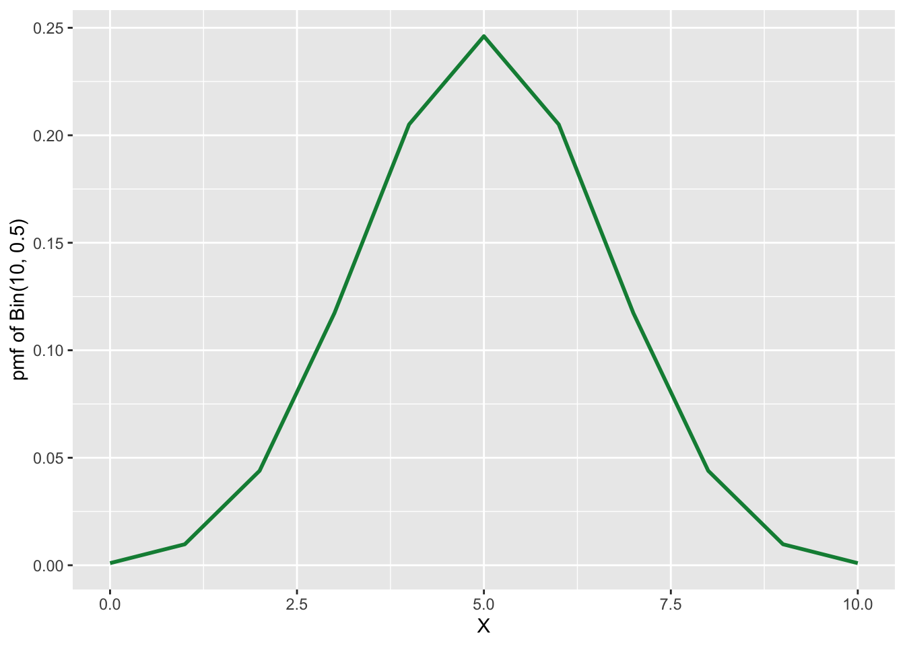

Then we know it's shape is symmetric about $x = \frac{1}{2}$. But if we take the density of $Poi(4)$.

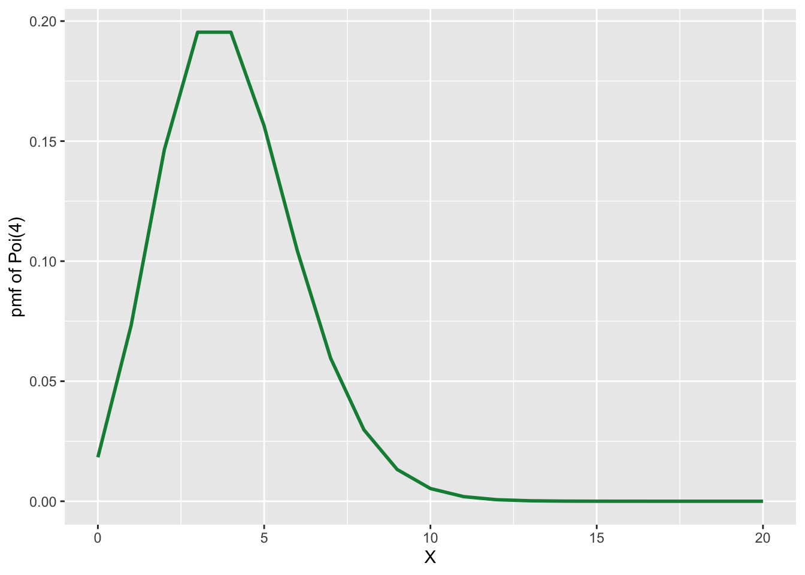

We will notice that it is not symmetric. The shape of the distribution is governed by the _nature_ of it's graph around the mean, wheather it is skewed left or right.

## Playing with Datasets in R
R has a lot inbuilt Datasets that one can use. The command

```r
data()
```
will list currently installed data sets.

Many datasets in R are often stored as data frame (`data.frame`). A data frame is a rectangular collection of variables (in the columns) and observations (in the rows). Let us learn about real data stored as data frame

```r
?airquality
```
Let us learn about `airquality` dataset a bit more. We can print entire data set on the screen by calling it

```r
airquality
```
but it prints entire dataset which may be large most of the times! Let us try the `head()` function

```r
head(airquality)
```

```
##   Ozone Solar.R Wind Temp Month Day
## 1    41     190  7.4   67     5   1
## 2    36     118  8.0   72     5   2
## 3    12     149 12.6   74     5   3
## 4    18     313 11.5   62     5   4
## 5    NA      NA 14.3   56     5   5
## 6    28      NA 14.9   66     5   6
```
This provides the first six rows. Now try the `tail()` function

```r
tail(airquality)
```

```
##     Ozone Solar.R Wind Temp Month Day
## 148    14      20 16.6   63     9  25
## 149    30     193  6.9   70     9  26
## 150    NA     145 13.2   77     9  27
## 151    14     191 14.3   75     9  28
## 152    18     131  8.0   76     9  29
## 153    20     223 11.5   68     9  30
```

This provides the last six rows. But sometimes we may want to print more or less rows. `head()` and `tail()` both functions has a parameter `n` with which we can print our desired number of rows.

```r
head(airquality, n = 10)
```

```
##    Ozone Solar.R Wind Temp Month Day
## 1     41     190  7.4   67     5   1
## 2     36     118  8.0   72     5   2
## 3     12     149 12.6   74     5   3
## 4     18     313 11.5   62     5   4
## 5     NA      NA 14.3   56     5   5
## 6     28      NA 14.9   66     5   6
## 7     23     299  8.6   65     5   7
## 8     19      99 13.8   59     5   8
## 9      8      19 20.1   61     5   9
## 10    NA     194  8.6   69     5  10
```

A specific datapoint of a data frame can be called using row and column number

```r
airquality[148, 4]
```

```
## [1] 63
```
The same can be printed by using the variable name for the given column and call it by it's position.

```r
airquality$Temp[148]
```

```
## [1] 63
```
An entire row can be printed like this.

```r
airquality[148, ]
```

```
##     Ozone Solar.R Wind Temp Month Day
## 148    14      20 16.6   63     9  25
```
We can pass vector of  Provides `Ozone` and `Temp` columns

```r
airquality[, c(1, 4)]
```

```
##     Ozone Temp
## 1      41   67
## 2      36   72
## 3      12   74
## 4      18   62
## 5      NA   56
## 6      28   66
## 7      23   65
## 8      19   59
## 9       8   61
## 10     NA   69
## 11      7   74
## 12     16   69
## 13     11   66
## 14     14   68
## 15     18   58
## 16     14   64
## 17     34   66
## 18      6   57
## 19     30   68
## 20     11   62
## 21      1   59
## 22     11   73
## 23      4   61
## 24     32   61
## 25     NA   57
## 26     NA   58
## 27     NA   57
## 28     23   67
## 29     45   81
## 30    115   79
## 31     37   76
## 32     NA   78
## 33     NA   74
## 34     NA   67
## 35     NA   84
## 36     NA   85
## 37     NA   79
## 38     29   82
## 39     NA   87
## 40     71   90
## 41     39   87
## 42     NA   93
## 43     NA   92
## 44     23   82
## 45     NA   80
## 46     NA   79
## 47     21   77
## 48     37   72
## 49     20   65
## 50     12   73
## 51     13   76
## 52     NA   77
## 53     NA   76
## 54     NA   76
## 55     NA   76
## 56     NA   75
## 57     NA   78
## 58     NA   73
## 59     NA   80
## 60     NA   77
## 61     NA   83
## 62    135   84
## 63     49   85
## 64     32   81
## 65     NA   84
## 66     64   83
## 67     40   83
## 68     77   88
## 69     97   92
## 70     97   92
## 71     85   89
## 72     NA   82
## 73     10   73
## 74     27   81
## 75     NA   91
## 76      7   80
## 77     48   81
## 78     35   82
## 79     61   84
## 80     79   87
## 81     63   85
## 82     16   74
## 83     NA   81
## 84     NA   82
## 85     80   86
## 86    108   85
## 87     20   82
## 88     52   86
## 89     82   88
## 90     50   86
## 91     64   83
## 92     59   81
## 93     39   81
## 94      9   81
## 95     16   82
## 96     78   86
## 97     35   85
## 98     66   87
## 99    122   89
## 100    89   90
## 101   110   90
## 102    NA   92
## 103    NA   86
## 104    44   86
## 105    28   82
## 106    65   80
## 107    NA   79
## 108    22   77
## 109    59   79
## 110    23   76
## 111    31   78
## 112    44   78
## 113    21   77
## 114     9   72
## 115    NA   75
## 116    45   79
## 117   168   81
## 118    73   86
## 119    NA   88
## 120    76   97
## 121   118   94
## 122    84   96
## 123    85   94
## 124    96   91
## 125    78   92
## 126    73   93
## 127    91   93
## 128    47   87
## 129    32   84
## 130    20   80
## 131    23   78
## 132    21   75
## 133    24   73
## 134    44   81
## 135    21   76
## 136    28   77
## 137     9   71
## 138    13   71
## 139    46   78
## 140    18   67
## 141    13   76
## 142    24   68
## 143    16   82
## 144    13   64
## 145    23   71
## 146    36   81
## 147     7   69
## 148    14   63
## 149    30   70
## 150    NA   77
## 151    14   75
## 152    18   76
## 153    20   68
```
**Note**: using `c()` function we can form any vector and that will enable display of the respective columns. We did not specify the row, so all rows will be displayed.

Five Number summary

```r
summary(airquality$Temp)
```

```
##    Min. 1st Qu.  Median    Mean 3rd Qu.    Max. 
##   56.00   72.00   79.00   77.88   85.00   97.00
```
Histogram

```r
hist(airquality$Temp)
```

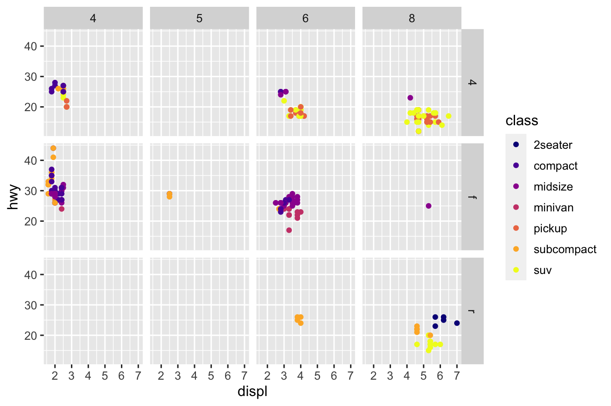

We can use the `plot()` function to just plot

```r
plot(airquality$Temp)
```

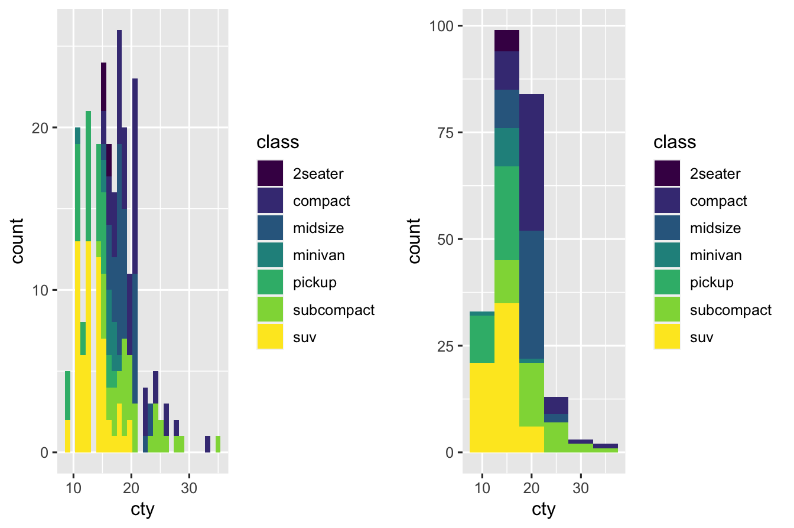

We can use the `plot()` function to get a Scatter plot

```r
plot(airquality$Ozone, airquality$Temp)
```

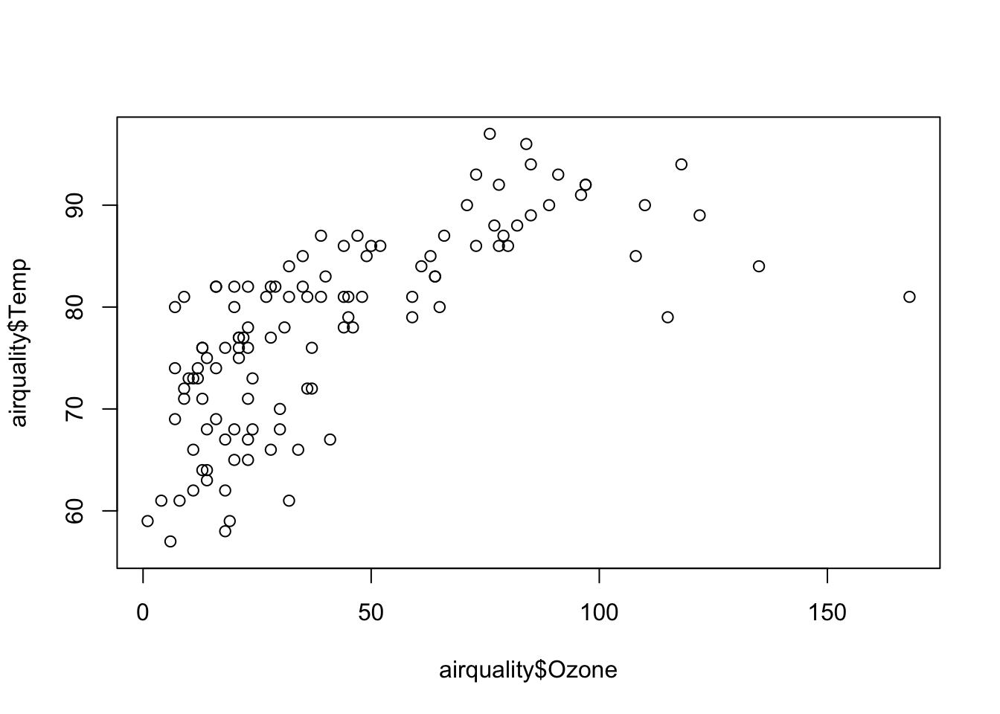

Plotting the whole dataset

```r
plot(airquality)
```

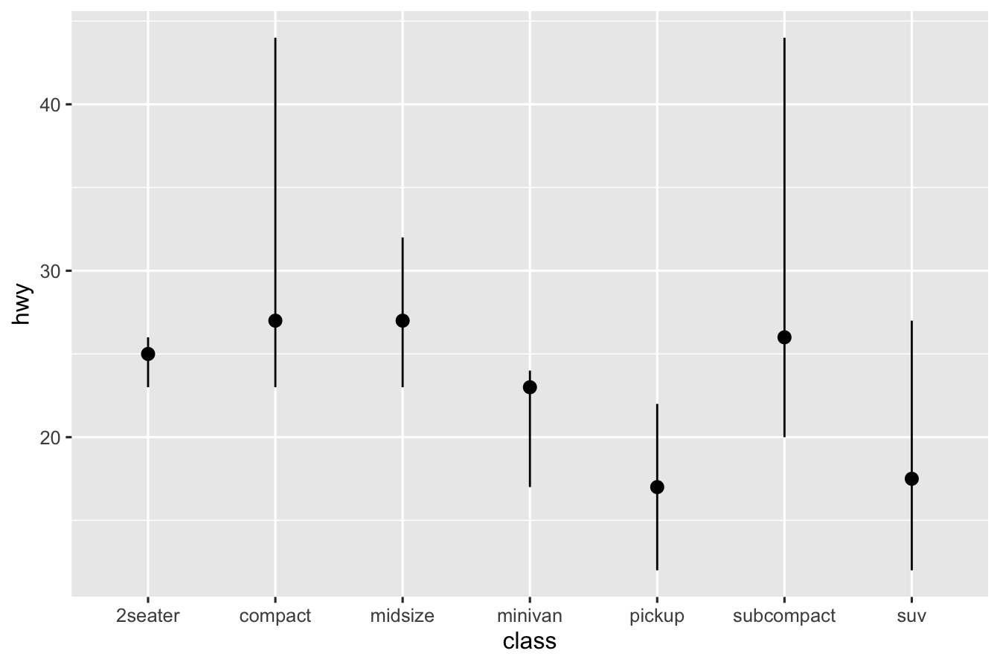


## `ggplot2` data visualization
This part will give you an understanding of data visualization using `ggplot2`. R does have many packages/methods to make graphs, but `ggplot2` is one of the most versatile one. It implements **grammar of graphics**, a powerful tool to describe and build the components of graphs concisely. If you are curious and want to get in-depth understanding of **grammar of graphics** in `ggplot2` you can read [The Layered Grammar of Graphics by Hadley Wickham](http://vita.had.co.nz/papers/layered-grammar.pdf).

First install `tidyverse` which includes the `ggplot2` package and then add to the current workspace.

```r
install.packages("tidyverse")
library("tidyverse")
```
A package needed to be installed once, but it needs to be (re)loaded in every new session.


### Basics
#### `mpg` dataset
`mpg` is a dataset in `tidyverse`, which contains observations collected by US Environment Protection Agency on 38 models of cars.

```r
mpg
```

```
## # A tibble: 234 × 11
##    manufacturer model      displ  year   cyl trans drv     cty   hwy fl    class
##    <chr>        <chr>      <dbl> <int> <int> <chr> <chr> <int> <int> <chr> <chr>
##  1 audi         a4           1.8  1999     4 auto… f        18    29 p     comp…
##  2 audi         a4           1.8  1999     4 manu… f        21    29 p     comp…
##  3 audi         a4           2    2008     4 manu… f        20    31 p     comp…
##  4 audi         a4           2    2008     4 auto… f        21    30 p     comp…
##  5 audi         a4           2.8  1999     6 auto… f        16    26 p     comp…
##  6 audi         a4           2.8  1999     6 manu… f        18    26 p     comp…
##  7 audi         a4           3.1  2008     6 auto… f        18    27 p     comp…
##  8 audi         a4 quattro   1.8  1999     4 manu… 4        18    26 p     comp…
##  9 audi         a4 quattro   1.8  1999     4 auto… 4        16    25 p     comp…
## 10 audi         a4 quattro   2    2008     4 manu… 4        20    28 p     comp…
## # … with 224 more rows
```


#### Our first ggplot
For plotting the relationship between `displ` and `hwy` variable in `mpg` dataset, run this code (It puts the variables in x and y axis respectively):

```r
ggplot(data = mpg) +
  geom_point(mapping = aes(x = displ, y = hwy))
```

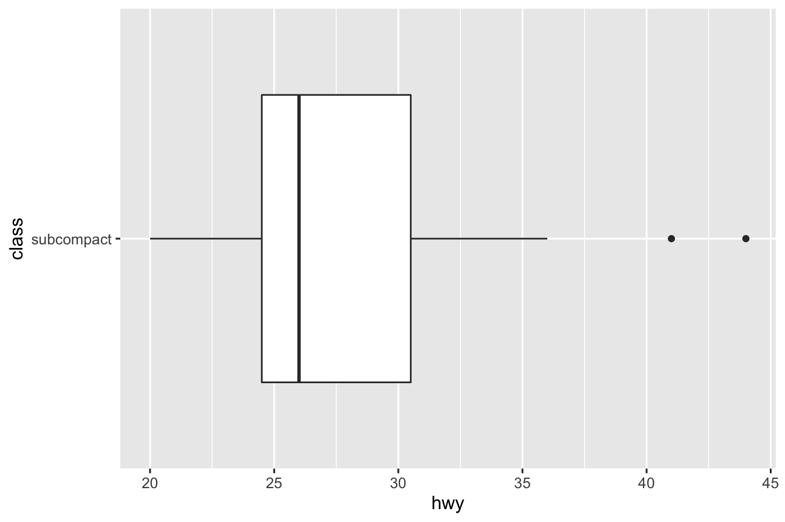

The plots shows _negative relationship_ between Engine Size(`displ`) and Fuel Efficiency(`hwy`).

Begins with a function `ggplot()`-creates a coordinate system that you can add addlayers to. The first arugment is the data set to use `ggplot(data = mpg)` creates an empty graph. Add layers to `ggplot()`- the function `geom_point()` adds a layer of points to your plot. Each geom function takes a mapping argument. The mapping argument is always paired with `aes()`


#### Template for graphing in `ggplot2`

  
  ```r
  ggplot(data = <DATA>) +  # nolint
   GEOM_FUNCTION(mapping = aes(<MAPPINGS>))
  ```
We will learn in the later subsections how to complete and extend this basic template to make different types of graphs.


```r
ggplot(data = mpg) +
  geom_point(mapping = aes(x = displ, y = hwy, colour = class))
```


To add colour for distinct values of `class` variable, we can add an `colour = class` by mapping it to an aesthetic.


```r
ggplot(data = mpg) +
  geom_point(mapping = aes(x = displ, y = hwy, colour = class)) +
  scale_colour_viridis_d(option = "plasma") +
  facet_wrap(~class, nrow = 2)
```

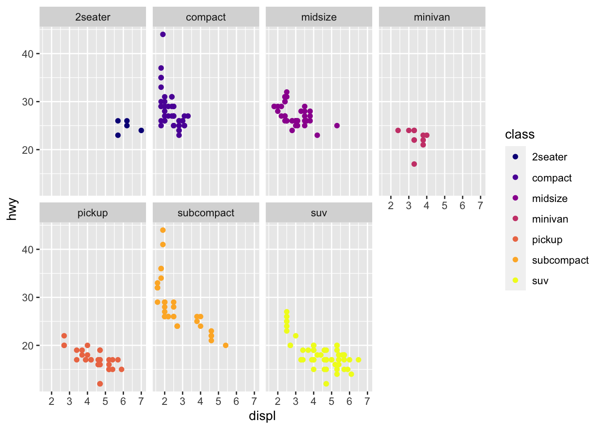

`facet_wrap` splits plot by a single variable into subplots that each display one subset of the data.


```r
ggplot(data = mpg) +
  geom_point(mapping = aes(x = displ, y = hwy, colour = class)) +
  scale_colour_viridis_d(option = "plasma") +
  facet_grid(drv~cyl)
```

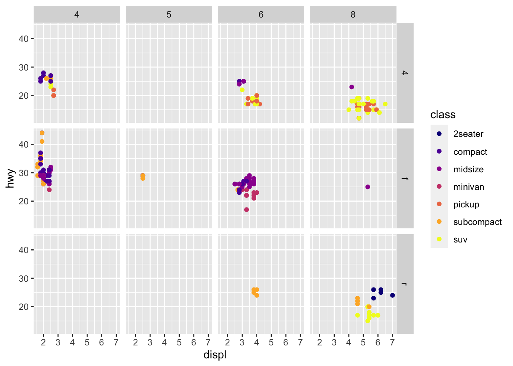

`facet_grid` splits plot by a combination of two variables into subplots that each display one subset of the data.

### Aesthetic mappings in `ggplot2`

- `aes()`: Associate the name of the aesthetic to the name of the variable.
  - the function gathers together each of the aesthetic mappings
  used by a layer.
  - passes them to the layer's mapping argument.
  - selects a reasonable scale to use with the aesthetic, and it constructs a legend (or axis labels) that explains the mapping
  between levels and values.
- Above example
  - Name=`colour` and Variable=`class`.
  - Scaling: assigns a unique level of the aesthetic colour to a unique level to the variable `class`.
  - Other aesthetics include : shape and size.


```r
ggplot(data = mpg) +
  geom_point(mapping = aes(x = displ, y = hwy), colour = "blue")
```


```r
ggplot(data = mpg) +
  geom_point(mapping = aes(x = displ, y = hwy, alpha = class))
```

```
## Warning: Using alpha for a discrete variable is not advised.
```


```r
ggplot(data = mpg) +
  geom_point(mapping = aes(x = displ, y = hwy, shape = class))
```

```
## Warning: The shape palette can deal with a maximum of 6 discrete values because
## more than 6 becomes difficult to discriminate; you have 7. Consider
## specifying shapes manually if you must have them.
```

```
## Warning: Removed 62 rows containing missing values (geom_point).
```


### Facets (wrap and grid).

Facets in `ggplot` splits the plot as per the argument.


```r
ggplot(data = mpg) +
  geom_point(mapping = aes(x = displ, y = hwy, color = class)) +
  scale_colour_viridis_d(option = "plasma") +
  facet_wrap(~class, nrow = 2)
```


Added a third variable called shape, alpha, blue-colour to a 2-D scatter plot by mapping it to an aesthetic.

### Geometric objects
Geometrical object that a plot uses to represent data.
  - bar-charts: `geom_bar`
  - line-charts: `geom_smooth`
  - box-plot: `geom_boxplot`
  - scatter: `geom_point`

Bar-charts: `geom_bar`
  - First specifies a sequence of points, called breaks.
  - It counts the number of observation between the breaks, called bins.
  - Places a bar in each bin with
    - base being the length of the bin and
    - height being either the frequency or proportion of observations in the bin.

<!-- # ```{r}
# ggplot(data = mpg, mapping = aes(x = cty, fill = class)) +
#   geom_histogram() +
#   scale_fill_viridis(discrete = TRUE)

# ggplot(data = mpg, mapping = aes(x = cty, fill = class)) +
#   geom_histogram(binwidth = 5) +
#   scale_fill_viridis(discrete = TRUE) -->
```

### Statistical transformations
Stat-count: Bar charts
A bar chart is a graph where for each category a bar with a height proportional to the count in the respective category is drawn. Along x-axis the categories (or levels) are displayed.


```r
table <- as.data.frame(table(mpg$class))

ggplot(data = table) +
  geom_bar(mapping = aes(x = Var1, stat = "identity"))
```

```
## Warning: Ignoring unknown aesthetics: stat
```

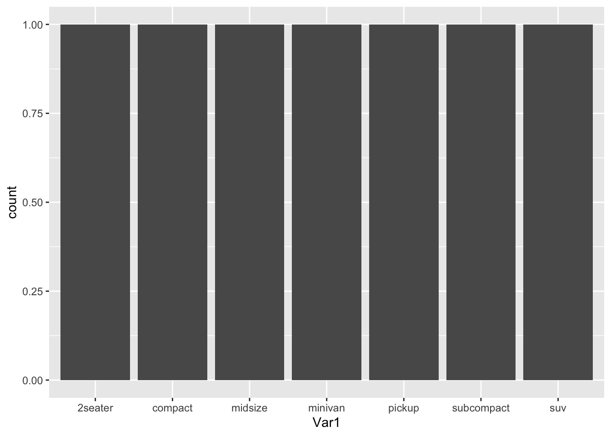

```r
ggplot(data = mpg) +
  stat_summary(
    mapping = aes(x = class, y = hwy),
    fun.min = min,
    fun.max = max,
    fun = median
  )
```

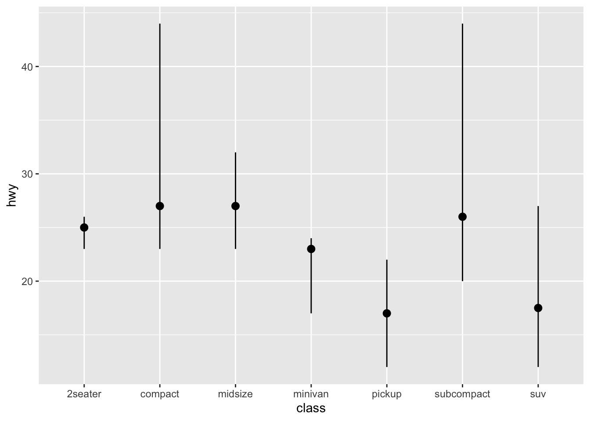

```r
ggplot(data = mpg) +
  geom_bar(mapping = aes(x = class, color = class))
```

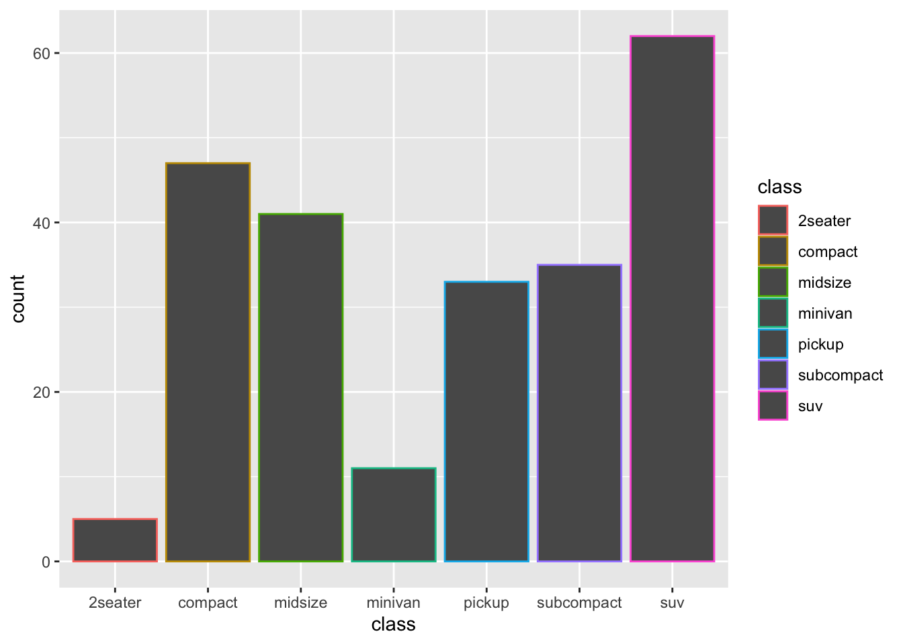

```r
ggplot(data = mpg) +
  stat_count(mapping = aes(x = class))
```


### Position adjustments
Hello

### Coordinate systems

```r
ggplot(data = mpg) +
  geom_bar(mapping = aes(x = class, fill = class)) +
  scale_fill_viridis_d() +
  coord_flip()
```


```r
ggplot(data = mpg) +
  geom_bar(mapping = aes(x = class, fill = class)) +
  scale_fill_viridis_d() +
  coord_polar()
```

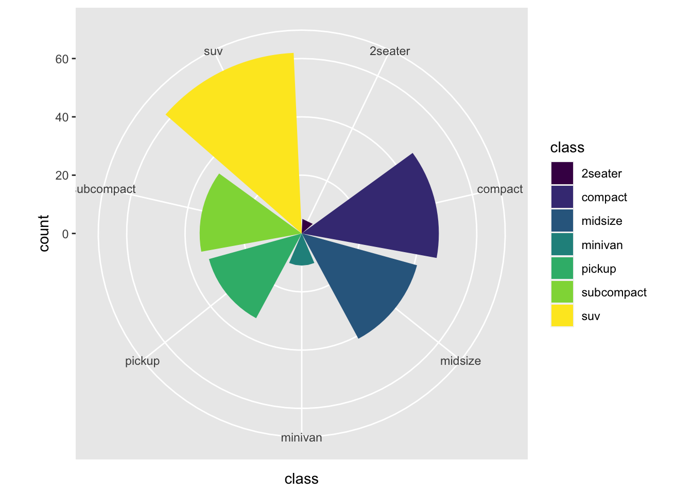

```r
ggplot(data = mpg, mapping = aes(x = class, y = hwy)) +
  geom_boxplot()
```


```r
ggplot(data = mpg, mapping = aes(x = class, y = hwy)) +
  geom_boxplot() +
  coord_flip()
```


```r
ggplot(data = mpg) +
  geom_bar(mapping = aes(x = class, fill = trans), position = "dodge") +
  scale_fill_viridis_d()
```

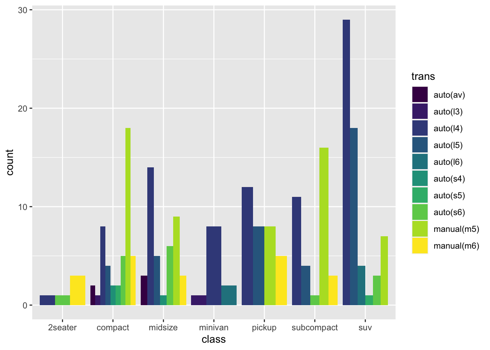


```r
ggplot(
  data = filter(mpg, class == "subcompact"),
  mapping = aes(x = class, y = hwy)
) +
  geom_boxplot() +
  coord_flip()
```

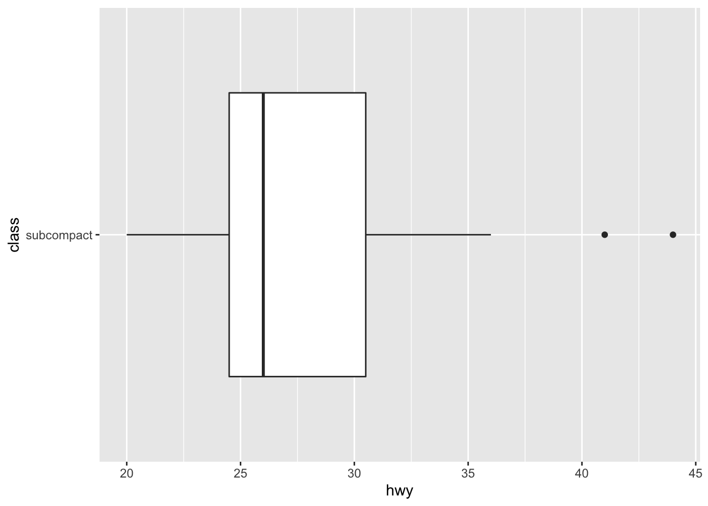


### The layered grammar of graphics
Hello

```r
ggplot(data = <DATA>) +
  <GEOM_FUNCTION>(
     mapping = aes(<MAPPINGS>),
     stat = <STAT>,
     position = <POSITION>
  ) +
  <COORDINATE_FUNCTION> +
  <FACET_FUNCTION>
```


### References {#references -}
[Journal of Computational and Graphical Statistics,5:3, pp. 299-314. 1996.](https://www.stat.auckland.ac.nz/~ihaka/downloads/R-paper.pdf)
