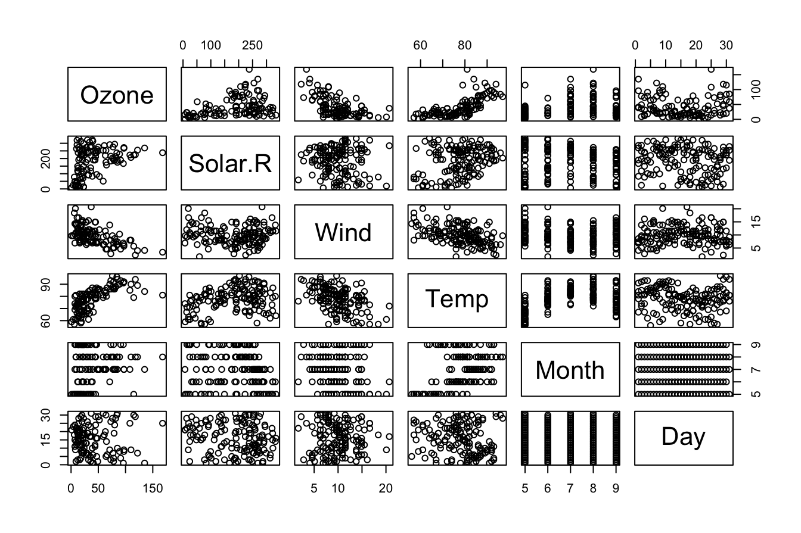
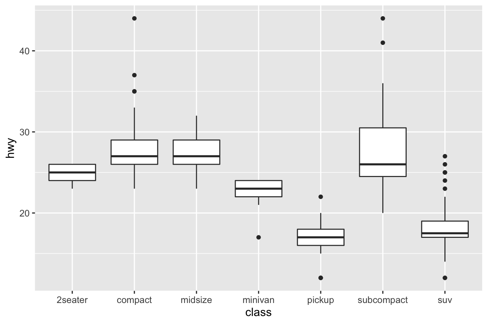

# R basics and Exploratory data analysis

> "Code is like humor. When you have to explain it, it's bad." --- Cory House

R is a great language heavily used by both academics and industrials for Machine Learning, Data Science and Deep Learning related stuffs. In this chapter, we will give you introduction to R, how to work with various R commands, plottig and visualizing data with R and how you can analyse and explore data using R.


## R {#r-lang}
  R is a free and open-source interpreted computer programming language and runs on Linux, Windows, and macOS. It is modeled after S and S-Plus. The S language was developed in the late 1980s at AT & T labs. The R project was started by Robert Gentleman and Ross Ihaka of the Statistics Department of the University of Auckland in [1995](#references). It is now a collaborative project with many contributors and is maintained by the [R core-development team](https://www.r-project.org/contributors.html).
  
### Installation and setup
  To download R, go to [CRAN](https://cran.r-project.org), the Comprehensive R Archive Network. CRAN is composed of a set of mirror servers distributed around the world and is used to distribute R and R packages. Don't try and pick a mirror that's close to you: instead use the cloud mirror, [https://cloud.r-project.org](https://cloud.r-project.org), which automatically figures it out for you.

  A new major version of R comes out once a year, and there are 2-3 minor releases each year. It's a good idea to update regularly. Upgrading can be a bit of a hassle, especially for major versions, which require you to reinstall all your packages, but putting it off only makes it worse.

#### RStudio
  RStudio is an IDE (integrated development environment) exclusively for R programming. Download and install it from [https://www.rstudio.com/download](https://www.rstudio.com/download). RStudio is updated a couple of times a year. When a new version is available, RStudio will let you know. It's a good idea to upgrade regularly so you can take advantage of the latest and greatest features.

  When you start RStudio, you will see two key regions in the interface:

  

#### R Packages
Sometimes you may need to install some additional packages. An **R package** is a collection of functions, datasets, documentation that extends the capabilities of base-R. Using packages you can enhance your data exploration capabilities in R. 

You can install an R package in this way.

```r
install.packages("UsingR")
```

Once installed you can add them in the current workspace by using `library()` function

```r
library("UsingR")
```

#### R help
R help is a great tool to make youself familiar with unknown R stuffs. All the R packages are well documented. You can get information about any function, dataset, package which are currently installed by just executing

```r
?object_name
```
It will open a documentation in the bottom right (where you saw the plot) section of RStudio. 

And to get help for any keyword execute

```r
??keyword
```
It will search throughout the R documentations of the currently installed packages and show all the results related to that keyword.

### Queries regarding operating R and RStudio

So far we have done some basic setup for R. Let's do some proper coding so that we make ourself familiar with this language.

#### Basic Coding in R
R can be used as calculator:

```r
9 / 44
#> [1] 0.2045455
0.6 * 0.4 + 0.3 * 0.6
#> [1] 0.42
log(0.6 * 0.4 + 0.3 * 0.6)
#> [1] -0.8675006
```


#### The `c()` function
Suppose we wish to enter scores in Computer Science class of 10 students. The scores are 40, 39, 15, 6, 18, 22, 30, 21, 15, 23.

```r
Scores <- c(40, 39, 15, 6, 18, 22, 30, 21, 15, 23)
```

`c()` is generic function in R which creates a [vector]() or [list]() of values with all of it's arguments coerced to a common type.

**Note**: We have assigned values to a variable `Scores` with the assignment operator `<-`. `=` can also be used for assignment but throughout this book we will use R-community preferred one ,i.e., `<-`. Sometimes we become lazy and use `=` instead of `<-` but don't worry, you can use a RStudio keyboard shoutcut: `Alt` + `-`(yes, the minus sign).

The value of a variable don't get automatically displayed unless we call the variable.

```r
Scores
#>  [1] 40 39 15  6 18 22 30 21 15 23
```

#### Inbuilt functions
Almost everything in R is done through functions. It has a lot of inbuilt functions. 
<!-- You can get a big non-exhaustive list [here]() -->
<!-- https://www.statmethods.net/management/functions.html -->
<!-- https://statisticsglobe.com/r-functions-list/ -->

```r
(40 + 39 + 15 + 6 + 18 + 22 + 30 + 21 + 15 + 23) / 10
#> [1] 22.9
```
Instead of writing such manaul expression we can just use the `mean()` function.

```r
mean(Scores)
#> [1] 22.9
sd(Scores)
#> [1] 10.75433
```
 No! `sd()` doesn't compute the positive square root of variance. It calculates the positive square root of _sample variance_, which is kind of same as variance but division is done by 1 less than the total number of observations instead of total number of observations. That is, if we have observations $X_1, X_2, \ldots, X_n$, then sample variance, $$ S^2 = \frac{1}{n-1}\sum_{j=1}^n (X_i - \overline{X})^2 $$
 
R functions are called like this:

```r
function_name(arg_1 = val1, arg_2 = val2, ...)
```
You can also call the functions in this way:

```r
function_name(val1, val2, ...)
```
But latter one is risky! You have to know the _order_ of the arguments given in the function definition. The **former one is recommended** in practice. It is better if you are using a function first time. No matter in what _order_ the arguments are defined, the values can be passed more easily to the proper arguments.

#### Manipulating vectors
Now we are going to show some useful vector manipulations in R. These will extremely helpful when you will manipulate datsets.

As discussed earlier `c()` is used to create vector with elements coerced to a same type. Individual elements can be accessed by specifying the index inside `[]` after the variable.

Suppose we want to change the entry of student 4 from 6 to 16 in `Scores`.

```r
Scores[4] <- 16
Scores
#>  [1] 40 39 15 16 18 22 30 21 15 23
```
We accessed the 4th entry by `Scores[4]` and using assignment operator we have changed the value.

**Note**: Unlike other programming languages, indexing of elements in vectors, lists, data frames, tibbles and other multi-valued data types in R starts from 1 not 0 !

Selecting some entries of `Scores`

```r
Scores[c(1, 3, 5)]
#> [1] 40 15 18
```

Suppose we want to see which students' Scores are equal to 30 marks

```r
which(Scores == 30)
#> [1] 7
```
or those with Scores lesser than or equal to 20.

```r
which(Scores <= 20)
#> [1] 3 4 5 9
```


```r
x <- 1:100
x
#>   [1]   1   2   3   4   5   6   7   8   9  10  11  12  13  14  15  16  17  18
#>  [19]  19  20  21  22  23  24  25  26  27  28  29  30  31  32  33  34  35  36
#>  [37]  37  38  39  40  41  42  43  44  45  46  47  48  49  50  51  52  53  54
#>  [55]  55  56  57  58  59  60  61  62  63  64  65  66  67  68  69  70  71  72
#>  [73]  73  74  75  76  77  78  79  80  81  82  83  84  85  86  87  88  89  90
#>  [91]  91  92  93  94  95  96  97  98  99 100
```


```r
x[x < 10 | x > 90]
#>  [1]   1   2   3   4   5   6   7   8   9  91  92  93  94  95  96  97  98  99 100
```


## Data
Statistics is based on data and it's analysis which has a rich and wide literature.

### Types of Data

We generally deal with 3 kinds of data in statistics:

- Discrete Numeric Data
- Categorical Data
- Continuous Numeric Data

[This paper](https://www.isibang.ac.in/~athreya/Teaching/statistics1/steven.pdf) gives a  broad classification of data from measurements into 9 categories.

### Discrete Numeric Data

Sometimes we see that many data are described in terms of numbers and many variables naturally take only discrete values. Such data can be visualized with Boxplot and Histograms.

Some imporatnt and key features of Discrete Numeric Data are Centre, Spread and the Spread.

- **Center** Widely used measure of centre is the `mean` or the average of the data set. Other measures include the `median` and the `mode` . They tell us where the data is centered around.
  For example, if we have a dataset of 10 numbers (Say, 1, 90, 48, 7, 7, 8, 9, 2, 3, 4) and order them by lowest to highest (i.e., 1, 2, 3, 4, 7, 7, 8, 9, 48, 90) and if we change the largest one by a larger number and smallest one by a smaller number the mean, median, mode may not change but if we change only the smallest one, then the mean will change but median and mode will not.

  
- **Spread** Understanding variabiity of the given data is very important. If one were to understand mean as specifying the center then the range  of the data set around it is determined by its variability or spread. It is often measured by the variance(`var`) or standard deviation(`sd`) or  the inter-quartile range(`IQR`).
  For example, Suppose, we have a dataset of Statistics exam score where everyone does well and get scores 98, 99, 100 then the spread of the data is low. But in the same exam if some students get 0, 4, 10 and some students get 90, 92 then the spread is high.


- **Shape** To understand various distributional aspects of the dataset one needs to understand its _shape_. For example, if it is symmetric or skewed round it's mean. Other aspects include among the data points which are more likely than others.
  For example, Suppose, we take the probability mass function of $Bin(10, \frac{1}{2})$


Then we know it's shape is symmetric about $x = \frac{1}{2}$. But if we take the density of $Poi(4)$.


We will notice that it is not symmetric. The shape of the distribution is governed by the _nature_ of it's graph around the mean, wheather it is skewed left or right.

### Playing with Datasets in R
R has a lot inbuilt Datasets that one can use. The command

```r
data()
```
will list currently installed data sets.

Many datasets in R are often stored as data frame (`data.frame`). A data frame is a rectangular collection of variables (in the columns) and observations (in the rows). Let us learn about a real dataset `airquality` stored as data frame. Use help to know about it.

```r
?airquality
```
You can print entire data set on the screen by calling it

```r
airquality
```
but it prints entire dataset which may be large most of the times! Let us try the `head()` function

```r
head(airquality)
#>   Ozone Solar.R Wind Temp Month Day
#> 1    41     190  7.4   67     5   1
#> 2    36     118  8.0   72     5   2
#> 3    12     149 12.6   74     5   3
#> 4    18     313 11.5   62     5   4
#> 5    NA      NA 14.3   56     5   5
#> 6    28      NA 14.9   66     5   6
```
This provides the first six rows. Now try the `tail()` function

```r
tail(airquality)
#>     Ozone Solar.R Wind Temp Month Day
#> 148    14      20 16.6   63     9  25
#> 149    30     193  6.9   70     9  26
#> 150    NA     145 13.2   77     9  27
#> 151    14     191 14.3   75     9  28
#> 152    18     131  8.0   76     9  29
#> 153    20     223 11.5   68     9  30
```

This provides the last six rows. But sometimes we may want to print more or less rows. `head()` and `tail()` both functions has a parameter `n` with which we can print our desired number of rows.

```r
head(airquality, n = 10)
#>    Ozone Solar.R Wind Temp Month Day
#> 1     41     190  7.4   67     5   1
#> 2     36     118  8.0   72     5   2
#> 3     12     149 12.6   74     5   3
#> 4     18     313 11.5   62     5   4
#> 5     NA      NA 14.3   56     5   5
#> 6     28      NA 14.9   66     5   6
#> 7     23     299  8.6   65     5   7
#> 8     19      99 13.8   59     5   8
#> 9      8      19 20.1   61     5   9
#> 10    NA     194  8.6   69     5  10
```

A specific datapoint of a data frame can be called using row and column number

```r
airquality[148, 4]
#> [1] 63
```
The same can be printed by using the variable name for the given column and call it by it's position.

```r
airquality$Temp[148]
#> [1] 63
```
An entire row can be printed like this.

```r
airquality[148, ]
#>     Ozone Solar.R Wind Temp Month Day
#> 148    14      20 16.6   63     9  25
```
We can pass vector of  Provides `Ozone` and `Temp` columns

```r
airquality[, c(1, 4)]
#>     Ozone Temp
#> 1      41   67
#> 2      36   72
#> 3      12   74
#> 4      18   62
#> 5      NA   56
#> 6      28   66
#> 7      23   65
#> 8      19   59
#> 9       8   61
#> 10     NA   69
#> 11      7   74
#> 12     16   69
#> 13     11   66
#> 14     14   68
#> 15     18   58
#> 16     14   64
#> 17     34   66
#> 18      6   57
#> 19     30   68
#> 20     11   62
#> 21      1   59
#> 22     11   73
#> 23      4   61
#> 24     32   61
#> 25     NA   57
#> 26     NA   58
#> 27     NA   57
#> 28     23   67
#> 29     45   81
#> 30    115   79
#> 31     37   76
#> 32     NA   78
#> 33     NA   74
#> 34     NA   67
#> 35     NA   84
#> 36     NA   85
#> 37     NA   79
#> 38     29   82
#> 39     NA   87
#> 40     71   90
#> 41     39   87
#> 42     NA   93
#> 43     NA   92
#> 44     23   82
#> 45     NA   80
#> 46     NA   79
#> 47     21   77
#> 48     37   72
#> 49     20   65
#> 50     12   73
#> 51     13   76
#> 52     NA   77
#> 53     NA   76
#> 54     NA   76
#> 55     NA   76
#> 56     NA   75
#> 57     NA   78
#> 58     NA   73
#> 59     NA   80
#> 60     NA   77
#> 61     NA   83
#> 62    135   84
#> 63     49   85
#> 64     32   81
#> 65     NA   84
#> 66     64   83
#> 67     40   83
#> 68     77   88
#> 69     97   92
#> 70     97   92
#> 71     85   89
#> 72     NA   82
#> 73     10   73
#> 74     27   81
#> 75     NA   91
#> 76      7   80
#> 77     48   81
#> 78     35   82
#> 79     61   84
#> 80     79   87
#> 81     63   85
#> 82     16   74
#> 83     NA   81
#> 84     NA   82
#> 85     80   86
#> 86    108   85
#> 87     20   82
#> 88     52   86
#> 89     82   88
#> 90     50   86
#> 91     64   83
#> 92     59   81
#> 93     39   81
#> 94      9   81
#> 95     16   82
#> 96     78   86
#> 97     35   85
#> 98     66   87
#> 99    122   89
#> 100    89   90
#> 101   110   90
#> 102    NA   92
#> 103    NA   86
#> 104    44   86
#> 105    28   82
#> 106    65   80
#> 107    NA   79
#> 108    22   77
#> 109    59   79
#> 110    23   76
#> 111    31   78
#> 112    44   78
#> 113    21   77
#> 114     9   72
#> 115    NA   75
#> 116    45   79
#> 117   168   81
#> 118    73   86
#> 119    NA   88
#> 120    76   97
#> 121   118   94
#> 122    84   96
#> 123    85   94
#> 124    96   91
#> 125    78   92
#> 126    73   93
#> 127    91   93
#> 128    47   87
#> 129    32   84
#> 130    20   80
#> 131    23   78
#> 132    21   75
#> 133    24   73
#> 134    44   81
#> 135    21   76
#> 136    28   77
#> 137     9   71
#> 138    13   71
#> 139    46   78
#> 140    18   67
#> 141    13   76
#> 142    24   68
#> 143    16   82
#> 144    13   64
#> 145    23   71
#> 146    36   81
#> 147     7   69
#> 148    14   63
#> 149    30   70
#> 150    NA   77
#> 151    14   75
#> 152    18   76
#> 153    20   68
```
**Note**: using `c()` function we can form any vector and that will enable display of the respective columns. We did not specify the row, so all rows will be displayed.

Five Number summary

```r
summary(airquality$Temp)
#>    Min. 1st Qu.  Median    Mean 3rd Qu.    Max. 
#>   56.00   72.00   79.00   77.88   85.00   97.00
```
Histogram

```r
hist(airquality$Temp)
```


We can use the `plot()` function to just plot

```r
plot(airquality$Temp)
```


We can use the `plot()` function to get a Scatter plot

```r
plot(airquality$Ozone, airquality$Temp)
```


Plotting the whole dataset

```r
plot(airquality)
```


### Data frames in R


```r
df <- data.frame(x = 1:10, y = 2:11)
```

### The `tidyverse`-package


### Reading Data frames into R

### Generating Random Data sets in R

```r
# df <- runif()
```

### Working With `dplyr`-package


```r
library("dplyr")
```

The [Master.csv](https://www.isibang.ac.in/~athreya/Teaching/ISCD/Master.csv) file contains Deceased data from Karnataka COVID-19 Bulletin

```r
decdf <- read.csv(
  file = "https://www.isibang.ac.in/~athreya/Teaching/ISCD/Master.csv",
  header = TRUE
)
head(decdf)
#>   Sno        District State.P.No Age.In.Years    Sex
#> 1   1      Kalaburagi          6           76   Male
#> 2   2 Chikkaballapura         53           70 Female
#> 3   3        Tumakuru         60           60   Male
#> 4   4      Bagalakote        125           75   Male
#> 5   5      Kalaburagi        177           65   Male
#> 6   6           Gadag        166           80 Female
#>                      Description Symptoms Co.Morbidities  DOA        DOD
#> 1 Travel history to Saudi Arabia     <NA>  HTN & Asthama <NA>       <NA>
#> 2        Travel history to Mecca     <NA>           <NA> <NA>       <NA>
#> 3        Travel history to Delhi     <NA>           <NA> <NA>       <NA>
#> 4                           <NA>     <NA>           <NA> <NA> 2020-04-03
#> 5                           SARI     <NA>           <NA> <NA>       <NA>
#> 6                           SARI     <NA>           <NA> <NA>       <NA>
#>      MB.Date Notes
#> 1 2020-03-13  <NA>
#> 2 2020-03-26  <NA>
#> 3 2020-03-27  <NA>
#> 4 2020-04-04  <NA>
#> 5 2020-04-08  <NA>
#> 6 2020-04-09  <NA>
names(decdf) <- c(
  "Sno", "District", "Pid", "Age", "Sex",
  "Description", "Symptoms", "CMB", "DOA",
  "DOD", "MB.Date", "Notes"
)
```

Some imporatnt `dplyr` functions:

#### `filter()`:
- Extract rows that meet logical criteria
- filters data according to the given condition

Filters data by age greater than 100

```r
filter(decdf, Age > 100)
#>     Sno        District     Pid Age    Sex Description
#> 1  3277 Bengaluru Urban  180841 102   Male         ILI
#> 2 17972 Bengaluru Rural 1361618 102   Male        SARI
#> 3 24686 Bengaluru Urban 1341967 102   Male        SARI
#> 4 27273 Bengaluru Urban 2360283 102 Female        SARI
#> 5 33704          Mysuru 2807010 110   Male        SARI
#> 6 34793          Haveri 2843699 101   Male       SARI 
#> 7 35077           Kolar 2816836 103   Male         ILI
#> 8 37190          Kodagu 2947715 101 Female        SARI
#> 9 37373  Uttara Kannada 2996149 102   Male         ILI
#>                        Symptoms      CMB        DOA        DOD    MB.Date
#> 1                  Fever, Cough CKD, IHD 2020-08-08 2020-08-08 2020-08-10
#> 2                Breathlessness  DM, HTN 2021-04-24 2021-04-25 2021-05-08
#> 3                Breathlessness       DM 2021-04-24 2021-05-04 2021-05-23
#> 4                Breathlessness        - 2021-05-11 2021-05-25 2021-05-27
#> 5  Fever, Cough, Breathlessness        - 2021-06-12 2021-06-17 2021-06-19
#> 6 Fever, Cough, Breathlessness  DM, HTN  2021-06-18 2021-06-28 2021-06-28
#> 7                  Fever, Cough        - 2021-06-14 2021-06-30 2021-07-01
#> 8  Fever, Cough, Breathlessness        - 2021-08-01 2021-08-26 2021-08-27
#> 9                  Fever, cough      HTN       <NA> 2021-09-02 2021-09-06
#>                   Notes
#> 1                  <NA>
#> 2                  <NA>
#> 3                  <NA>
#> 4                  <NA>
#> 5                  <NA>
#> 6                  <NA>
#> 7                  <NA>
#> 8                  <NA>
#> 9 Died at his residence
```
Retains only the rows satisfying the given conditions

```r
filter(decdf, Age > 100 & Sex == "Female")
#>     Sno        District     Pid Age    Sex Description
#> 1 27273 Bengaluru Urban 2360283 102 Female        SARI
#> 2 37190          Kodagu 2947715 101 Female        SARI
#>                       Symptoms CMB        DOA        DOD    MB.Date Notes
#> 1               Breathlessness   - 2021-05-11 2021-05-25 2021-05-27  <NA>
#> 2 Fever, Cough, Breathlessness   - 2021-08-01 2021-08-26 2021-08-27  <NA>
```


```r
head(decdf$DOA)
#> [1] NA NA NA NA NA NA
head(decdf$MB.Date)
#> [1] "2020-03-13" "2020-03-26" "2020-03-27" "2020-04-04" "2020-04-08"
#> [6] "2020-04-09"
```

Drop the NA rows

```r
decdf <- filter(decdf, !is.na(DOD))
```
Can't be done with subset()


#### `mutate()`:
- To add new variable without affecting original ones

```r
decdf <- mutate(
  decdf,
  reporting.time = as.Date(decdf$MB.Date) - as.Date(decdf$DOD)
  # Here we have added new variable "reporting.time" to the dataframe
  # Original variables are not affected
)
```

Similarly added a new variable "months"

```r
decdf <- mutate(decdf,
  Month = months(as.Date(decdf$MB.Date))
)
```

#### `distinct()`:
- Removes rows with duplicate values

Selects distinct rows of Age variable

```r
DT <- distinct(decdf, Age)
```

Other variables can be kept with .keep_all = TRUE argument

```r
DT <- distinct(decdf, Age, .keep_all = TRUE)
```


#### `slice()`:  
- Select rows by position

```r
SL <- slice(decdf, 10:12)
head(SL, 2)
#>   Sno        District Pid Age  Sex Description       Symptoms
#> 1  24           Bidar 590  82 Male        SARI           <NA>
#> 2  25 Bengaluru Urban 557  63 Male        <NA> Breathlessness
#>                                        CMB        DOA        DOD    MB.Date
#> 1                                     <NA> 2020-04-27 2020-04-28 2020-05-02
#> 2 Diabetes & Hypertension & Hypothyroidism 2020-04-30 2020-05-02 2020-05-02
#>   Notes reporting.time Month
#> 1  <NA>         4 days   May
#> 2  <NA>         0 days   May
```


#### `group_by()`:
- To create a "grouped" copy of a table grouped by columns in ... `dplyr` functions will manipulate each "group" separately and combine the results.


```r
GS <- group_by(decdf, Sex)
```
groups data by the specified variable.

```r
head(GS, 3)
#> # A tibble: 3 × 14
#> # Groups:   Sex [1]
#>     Sno District          Pid   Age Sex   Description Symptoms CMB   DOA   DOD  
#>   <int> <chr>           <int> <dbl> <chr> <chr>       <chr>    <chr> <chr> <chr>
#> 1     4 Bagalakote        125    75 Male  NA          NA       NA    NA    2020…
#> 2    11 Chikkaballapura   250    65 Male  NA          H1N1 po… DM &… 2020… 2020…
#> 3    13 Bengaluru Urban   195    66 Male  NA          NA       NA    2020… 2020…
#> # … with 4 more variables: MB.Date <chr>, Notes <chr>, reporting.time <drtn>,
#> #   Month <chr>
```

NOTE: Display does NOT show grouping, but it will specify the groups


#### `summarise()`:
- Compute table of summaries
- Summarises multiple values into a single value

Gives the mean of age for each gender.

```r
summarise(GS, mean(Age, na.rm = TRUE))
#> # A tibble: 10 × 2
#>   Sex    `mean(Age, na.rm = TRUE)`
#>   <chr>                      <dbl>
#> 1 F                           65.2
#> 2 Female                      60.7
#> 3 M                           66.1
#> 4 M E23                       71  
#> 5 Male                        60.7
#> 6 N                           39  
#> # … with 4 more rows
```


#### `sample_n()`:
- To select random rows according to the value specified

Selects 2 random rows from dataframe decdf.

```r
sample_n(decdf, size = 2)
#>     Sno        District     Pid Age    Sex Description
#> 1 11038 Bengaluru Urban  802891  76   Male         ILI
#> 2 36162 Bengaluru Urban 2865711  58 Female        SARI
#>                       Symptoms         CMB        DOA        DOD    MB.Date
#> 1                 Fever, Cough         HTN 2020-10-21 2020-10-27 2020-10-28
#> 2 Fever, Cough, Breathlessness DM, HTN, CA 2021-06-24 2021-07-18 2021-07-19
#>   Notes reporting.time   Month
#> 1  <NA>         1 days October
#> 2  <NA>         1 days    July
```

Selects 0.0001-fraction of rows at random.

```r
sample_frac(decdf, size = 0.0001)
#>     Sno        District     Pid Age    Sex Description
#> 1 15681 Bengaluru Urban 1394442  53 Female         ILI
#> 2 11875 Chikkaballapura  896738  65   Male        SARI
#> 3 14824 Bengaluru Urban 1121723  82 Female        SARI
#> 4  4938        Tumakuru  283766  45 Female        SARI
#>                       Symptoms      CMB        DOA        DOD    MB.Date Notes
#> 1                        Fever      HTN 2021-04-24 2021-04-26 2021-05-01  <NA>
#> 2 Fever, Cough, Breathlessness  DM, HTN 2020-11-28 2020-12-05 2020-12-08  <NA>
#> 3               Breathlessness  DM, HTN 2021-04-14 2021-04-25 2021-04-28  <NA>
#> 4        Cough, Breathlessness DM, COPD 2020-08-22 2020-08-22 2020-08-25  <NA>
#>   reporting.time    Month
#> 1         5 days      May
#> 2         3 days December
#> 3         3 days    April
#> 4         3 days   August
```


#### `count()`:
- To count the unique values of one or more variables

Gives a frequency table for months

```r
count(decdf, Month)
#>        Month     n
#> 1      April  2963
#> 2     August  4107
#> 3   December   429
#> 4   February   481
#> 5    January   837
#> 6       July  3561
#> 7       June  6046
#> 8      March   236
#> 9        May 13592
#> 10  November   736
#> 11   October  2593
#> 12 September  3643
#> 13      <NA>    17
```


#### `arrange()`:
- Order rows by values of a column or columns (low to high)
- use with desc() to order from high to low


```r
orderdf <- arrange(decdf, Age)
```
Creates a new dataframe orderdf having rows arranged by - Age.

```r
head(orderdf, 2)
#>     Sno        District     Pid    Age    Sex Description       Symptoms CMB
#> 1 14253 Bengaluru Urban 1260623 0.0000   Male        SARI Breathlessness HTN
#> 2 20970      Ramanagara 2032210 0.0082 Female        SARI Breathlessness   -
#>          DOA        DOD    MB.Date Notes reporting.time Month
#> 1 2021-04-21 2021-04-23 2021-04-24  <NA>         1 days April
#> 2 2021-05-07 2021-05-10 2021-05-14  <NA>         4 days   May
```

Arranges the data in alphabetical order of the variable - Description

```r
orderdf2 <- arrange(decdf, Description)
```


#### The pipe operator - `%>%`
- Used to chain codes
- `x %>% f(y)` becomes `f(x, y)`


```r
filteredData <- filter(decdf, Month != "September")
groupedData <- group_by(filteredData, Month)
summarise(groupedData, mean(Age, na.rm = TRUE))
#> # A tibble: 11 × 2
#>   Month    `mean(Age, na.rm = TRUE)`
#>   <chr>                        <dbl>
#> 1 April                         61.2
#> 2 August                        61.3
#> 3 December                      64.9
#> 4 February                      65.3
#> 5 January                       63.6
#> 6 July                          60.0
#> # … with 5 more rows
```

The same code written shortly with Pipe - `%>%`

```r
decdf %>%
  filter(Month != 5) %>%
  group_by(Month) %>%
  summarise(mean(Age, na.rm = TRUE))
#> # A tibble: 12 × 2
#>   Month    `mean(Age, na.rm = TRUE)`
#>   <chr>                        <dbl>
#> 1 April                         61.2
#> 2 August                        61.3
#> 3 December                      64.9
#> 4 February                      65.3
#> 5 January                       63.6
#> 6 July                          60.0
#> # … with 6 more rows
```

## Date and Time in R
There are many options in R to handle Dates and Times. `R` handles date and time in three classes:
- `as.Date`
- `POSIXlt`
- `POSIXct`

POSIX - Portable OS interface on UNIX (allow for date & time without timezone)
2 packages for date-time manipulation
 - `chron`
 - `lubricate`


```r
library("chron")
library("lubridate")
#> 
#> Attaching package: 'lubridate'
#> The following objects are masked from 'package:chron':
#> 
#>     days, hours, minutes, seconds, years
#> The following objects are masked from 'package:base':
#> 
#>     date, intersect, setdiff, union
```

For handling dates without times `as.Date()` is the best choice

```r
as.Date("1/15/2001", format = "%m/%d/%Y")
#> [1] "2001-01-15"
as.Date("April 26, 2001", format = "%B %d, %Y")
#> [1] "2001-04-26"
as.Date("22JUN01", format = "%d%b%y")
#> [1] "2001-06-22"
```

We have specify format if input dates are not in standard format

| Code | Value | 
|---|---|
|%d | day of the month (decimal number)|
|%m | month (decimal number)|
|%Y | Year (4 digits)|
|%B | Month (Full name)|
|%y | Year (2 digits)|
|%b | Month (3 letter abbrebiated name)|


```r
bdays <- c(
  CRRao = as.Date("1920-09-10"),
  PCMahalanobis = as.Date("1893-06-29"),
  Cramer = as.Date("1893-09-25"),
  KRParthasarathy = as.Date("1936-06-25")
)
```


`weekdays()` and `months()` are 2 inbuilt functions in R that provide day of the weekand and name of the month respectively
A vector of weekdays extarcted from the elements bdays

```r
weekdays(bdays)
#>           CRRao   PCMahalanobis          Cramer KRParthasarathy 
#>        "Friday"      "Thursday"        "Monday"      "Thursday"
```
A vector of months extarcted from the elements bdays

```r
months(bdays)
#>           CRRao   PCMahalanobis          Cramer KRParthasarathy 
#>     "September"          "June"     "September"          "June"
```

For computation with dates we must specify format of date

```r
datef1 <- as.Date("02/08/2021", format = "%m/%d/%Y")
datef1
#> [1] "2021-02-08"

datef2 <- as.Date("February 8, 2021", format = "%B %d, %Y")
datef2
#> [1] "2021-02-08"
```


```r
datef <- as.Date("04/08/2021", format = "%m/%d/%Y")
datef2 <- as.Date("October 8, 2021", format = "%B %d, %Y")
```

Subtraction - specifies difference in days

```r
datef1 - datef2
#> Time difference of -242 days
```

Built-in function `difftime()` - specifies the diff in specified units

```r
difftime(datef1, datef2, units = "weeks")
#> Time difference of -34.57143 weeks
difftime(datef1, datef2, units = "days")
#> Time difference of -242 days
difftime(datef1, datef2)
#> Time difference of -242 days
datef1
#> [1] "2021-02-08"
datef2
#> [1] "2021-10-08"
```


Add and subract days form dates

```r
datef2 + 10
#> [1] "2021-10-18"
datef1 - 10
#> [1] "2021-01-29"
```

Vector of dates

```r
three.days <- as.Date(c("2020-07-22", "2019-04-20", "2022-10-06"))
three.days
#> [1] "2020-07-22" "2019-04-20" "2022-10-06"
```

interval differences between dates

```r
diff(three.days)
#> Time differences in days
#> [1] -459 1265
```


Produce 7 dates that differ by a week, starting from datef1

```r
Seven <- seq(datef1, length = 7, by = "week")
Seven
#> [1] "2021-02-08" "2021-02-15" "2021-02-22" "2021-03-01" "2021-03-08"
#> [6] "2021-03-15" "2021-03-22"
```

Produce 7 dates that differ by a 14 days, starting from datef1

```r
Seven <- seq(datef1, length = 7, by = 14)
Seven
#> [1] "2021-02-08" "2021-02-22" "2021-03-08" "2021-03-22" "2021-04-05"
#> [6] "2021-04-19" "2021-05-03"
```

Produce 7 dates that differ by a 2 weeks (same as prev one), starting from datef1

```r
Seven <- seq(datef1, length = 7, by = "2 weeks")
Seven
#> [1] "2021-02-08" "2021-02-22" "2021-03-08" "2021-03-22" "2021-04-05"
#> [6] "2021-04-19" "2021-05-03"
```


It is conjunction with a package - `stringr` --- very useful
Combine dates & times with string manipulation

```r
?strptime
```

 POSIX- Portable OS interface on UNIX (allow for dat & time without timezone)
 chron - (allows for dates & time)

```r
as.POSIXct()
```

- Handles dates and times
- also takes care of time zones
- accurate representation of time


```r
Time1 <- as.POSIXct(x = "2023-07-24 23:55:26")
Time1
#> [1] "2023-07-24 23:55:26 UTC"

Time2 <- as.POSIXct("25072023 08:32:07", format = "%d%m%Y %H:%M:%S")
Time2
#> [1] "2023-07-25 08:32:07 UTC"
```

Specifying timezone

```r
Time3 <- as.POSIXct("2020-01-01 11:42:03", tz = "GMT")
Time3 <- as.POSIXct("2020-01-01 11:42:03", tz = Sys.timezone())
Time3
#> [1] "2020-01-01 11:42:03 UTC"
```

To get timezone of the system

```r
Sys.timezone()
#> [1] "UTC"
```

Operations with times

```r
Time2 > Time1
#> [1] TRUE
```

Time difference

```r
Time2 - Time1
#> Time difference of 8.611389 hours
```

adds 30s

```r
Time1 + 30
#> [1] "2023-07-24 23:55:56 UTC"
```
subtract 30s

```r
Time1 - 30
#> [1] "2023-07-24 23:54:56 UTC"
```


Use `as.` to do computations
Adjust for daylight savings time

```r
as.POSIXct("2021-03-10 08:32:07") - as.POSIXct("2023-03-09 23:55:26")
#> Time difference of -729.6412 days
Sys.time()
#> [1] "2022-06-27 16:57:39 UTC"
```

 - Internal integer representstion

```r
unclass(Time1)
#> [1] 1690242926
#> attr(,"tzone")
#> [1] ""
```
 - difference from 1970-01-01 00:00:00 UTC

```r
difftime(Time1, as.POSIXct("1970-01-01 00:00:00", tz = "UTC"), units = "secs")
#> Time difference of 1690242926 secs
```


`lt` - Local time
`ct` - Calender time

```r
Time1.lt <- as.POSIXlt("2022-07-24 23:55:26")
Time1.lt
#> [1] "2022-07-24 23:55:26 UTC"
```

 These 2 functions are used to strip specific units from date & time
 in column form

```r
unclass(Time1.lt)
#> $sec
#> [1] 26
#> 
#> $min
#> [1] 55
#> 
#> $hour
#> [1] 23
#> 
#> $mday
#> [1] 24
#> 
#> $mon
#> [1] 6
#> 
#> $year
#> [1] 122
#> 
#> $wday
#> [1] 0
#> 
#> $yday
#> [1] 204
#> 
#> $isdst
#> [1] 0
#> 
#> attr(,"tzone")
#> [1] "UTC"
```
 in list form

```r
unlist(Time1.lt)
#>   sec   min  hour  mday   mon  year  wday  yday isdst 
#>    26    55    23    24     6   122     0   204     0
```

 getting seconds of Time1.lt

```r
Time1.lt$sec
#> [1] 26
```
 getting corresponding weekday number of Time1.lt

```r
Time1.lt$wday
#> [1] 0
```

 date & time till the day

```r
trunc(Time1.lt, "days")
#> [1] "2022-07-24 UTC"
```
 date & time till the minuites

```r
trunc(Time1.lt, "mins")
#> [1] "2022-07-24 23:55:00 UTC"
```

The chron R package

```r
require(chron)
```

Creating times in chron


```r
time1.c <- as.chron("2013-07-24 23:55:26")
```
Gives time in chron format

```r
time1.c
#> [1] (07/24/13 23:55:26)
```


```r
time2.c <- as.chron("07/25/13", "%m/%d/%Y")
```
Gives date in the specified format

```r
time2.c
#> [1] (07/25/13 00:00:00)
```

Extracting the date with date()

```r
dates(time1.c)
#>     day  
#> 07/24/13
```

Operaions with time variable
logical statement comparing time

```r
time2.c > time1.c
#> [1] FALSE
```

Adding 10 days

```r
time1.c + 10
#> [1] (08/03/13 23:55:26)
```

Subtraction of time vaiable

```r
time2.c - time1.c
#> [1] -730485
```

Gives difference in the unit specified hours

```r
difftime(time2.c, time1.c, unit = "hours")
#> Time difference of -17531640 hours
```

Gives difference in the time

```r
as.chron("2013-03-10 08:32:07") - as.chron("2013-03-09 23:55:26")
#> [1] 08:36:41
```

NOTE: Chron does not adjust for the time zones


## Factors and Levels in R


R categorical data
Factors and Levels
- used to plot categorical data in R

See the following packages in the book - R for Data Science
- dplyr (https://r4ds.had.co.nz/transform.html#dplyr-basics)
- forcats (https://r4ds.had.co.nz/factors.html#prerequisites-9)


Keys: How base-R handles categorical data or variables?


Categorical Variables - Qualitative variables
,i.e., those which cannot meaningfully be expressed in numbers.
Eg.: Clothes, Colour.
-> Base-R deals with them through the use of factors.
-> factors are useful in Statistical Modeling and Plotting data.

-> Packages - tidyverse- dplyr, tidyr, forcats, readr
help in dealing with factors.

`factor(x)`
- Store as vector  of integers
- Displayed as characters


```r
xc <- c(
    "June", "July", "August", "September",
    "August", "July", "July", "August"
)
```
create a vector of data

```r
factorxc <- factor(xc)
```
store the vector as a factor using factor()

```r
factorxc
#> [1] June      July      August    September August    July      July     
#> [8] August   
#> Levels: August July June September
```
factors in R are stored as a vector of integers but they correspond to a character string for display
Levels are the unique set of values taken by `as.character()` [this is the default assignment]
factor levels are always characters


xn - numeric data as factors

```r
xn <- c(1, 2, 2, 3, 1, 2, 3, 3, 1, 2, 3, 3, 1)
```
Create a vector of data

```r
factorxn <- factor(xn)
```
Store it as a factor using factor()

```r
factorxn
#>  [1] 1 2 2 3 1 2 3 3 1 2 3 3 1
#> Levels: 1 2 3
```
Note: factor levels are always characters


Both numeric and character data can be stored as factors

```r
mean(xn)
#> [1] 2.076923
```
But, factor levels are always characters

```r
mean(factorxn)
#> Warning in mean.default(factorxn): argument is not numeric or logical: returning
#> NA
#> [1] NA
```
Since, argument is not numeric, so will return NA

use levels() function to convert them to original numeric value

```r
mean(as.numeric(levels(factorxn)[factorxn]))
#> [1] 2.076923
```


xc - character data as factors

```r
xc <- c(
    "June", "July", "August", "September",
    "August", "July", "July", "August"
)
factorxc <- factor(xc)
factorxc
#> [1] June      July      August    September August    July      July     
#> [8] August   
#> Levels: August July June September
```


```r
table(factorxc)
#> factorxc
#>    August      July      June September 
#>         3         3         1         1
```
table() gives frequency of each level

ordering is w.r.t. to as.character(.)  and not related to the order in the vector.

```r
months <- factor(xc,
    levels = c(
        "Garbage", "January", "February",
        "March", "April", "May", "June", "July", "August",
        "September", "October", "November", "December"
    ),
    ordered = TRUE
)
```
we can specify the levels and the order that we want

```r
months
#> [1] June      July      August    September August    July      July     
#> [8] August   
#> 13 Levels: Garbage < January < February < March < April < May < ... < December
```
Here, in our specification, levels contain elements not present in months

```r
months[3] < months[4]
#> [1] TRUE
```

When factor is created, all it's levels are stored with the factor

```r
table(months)
#> months
#>   Garbage   January  February     March     April       May      June      July 
#>         0         0         0         0         0         0         1         3 
#>    August September   October  November  December 
#>         3         1         0         0         0
```
- table() will display  ALL the levels specified and respective counts
- occur when subsetting a factor


```r
factor(months)
#> [1] June      July      August    September August    July      July     
#> [8] August   
#> Levels: June < July < August < September
```
retains only the levels present without affecting the ordering (i.e and maintains their order.)

```r
table(factor(months))
#> 
#>      June      July    August September 
#>         1         3         3         1
```
Gives the count of ONLY the levels present in the factor


#####

```r
x <- round(1000 * runif(10))
x
#>  [1] 662 388 837 151 347 489 149 357 963 132
```

cut() function is used to convert a numeric variable into a factor
Syntax: cut(numeric data, breaks)

```r
xfactor <- cut(x, 4)
```
breaks
- arbitary by default
- specifies how range of numbers will be converted to factor values

```r
xfactor
#>  [1] (548,755] (340,548] (755,964] (131,340] (340,548] (340,548] (131,340]
#>  [8] (340,548] (755,964] (131,340]
#> Levels: (131,340] (340,548] (548,755] (755,964]
table(xfactor)
#> xfactor
#> (131,340] (340,548] (548,755] (755,964] 
#>         3         4         1         2
```
displays the count of each level that was created using cut()


```r
cut(x, 3, labels = c("L", "M", "H"))
#>  [1] M L H L L M L L H L
#> Levels: L M H
```
`label()` - used to specify the levels of the factors

Nicer set of labels with pretty()

```r
xpfactor <- cut(x, pretty(x, 4))
xpfactor
#>  [1] (600,800]   (200,400]   (800,1e+03] (0,200]     (200,400]   (400,600]  
#>  [7] (0,200]     (200,400]   (800,1e+03] (0,200]    
#> Levels: (0,200] (200,400] (400,600] (600,800] (800,1e+03]
```
but may or may not provide more levels than specified

```r
table(xpfactor)
#> xpfactor
#>     (0,200]   (200,400]   (400,600]   (600,800] (800,1e+03] 
#>           3           3           1           1           2
```
displays the count of each level created with pretty()


```r
xqfactor <- cut(x, quantile(x, probs = seq(0, 1, 0.25)))
```
Produce factors based on percentiles of your data


```r
table(xqfactor)
#> xqfactor
#> (132,200] (200,372] (372,619] (619,963] 
#>         2         2         2         3
```
observations are distributed "equally" in each level


```r
everyday <- seq(
    from = as.Date("2021-1-1"),
    to = as.Date("2021-12-31"),
    by = "day"
)
```
Create factors from dates/times
`strptime()`, `strftime()` with factors and levels would be very useful for extracting information with ordering from a scraped dataset.


```r
cmonth <- format(everyday, "%b")
```
format() can be used to extract the month from each date using '%b'
Extract month from each day

```r
head(cmonth, 3)
#> [1] "Jan" "Jan" "Jan"
```


```r
df <- as.data.frame(table(cmonth))
```
`table()`
- tabulates values in each month
- ordering in alphabetcal
`as.data.frame()` stores the output as dataframe

```r
names(df) <- c("Month", "Freq")
```
changing the names of the variables of the dataframe d
df


```r
months <- factor(cmonth,
    levels = unique(cmonth), ordered = TRUE
)
```
`unique()`: returns the unique values in the order that are encountered
stored months as factors

```r
df2 <- as.data.frame(table(months))
names(df2) <- c("Month", "Freq")
```
specified levels & ordering using the `unique()`

```r
df2
#>    Month Freq
#> 1    Jan   31
#> 2    Feb   28
#> 3    Mar   31
#> 4    Apr   30
#> 5    May   31
#> 6    Jun   30
#> 7    Jul   31
#> 8    Aug   31
#> 9    Sep   30
#> 10   Oct   31
#> 11   Nov   30
#> 12   Dec   31
```


```r
everyday <- seq(
    from = as.Date("2021-1-1"), to = as.Date("2021-12-31"),
    by = "day"
)
```
vector of all Dates of the year 2021


```r
wks <- cut(everyday, breaks = "week")
```
levels - 53 dates of each week of the year 2021

```r
wks
#>   [1] 2020-12-28 2020-12-28 2020-12-28 2021-01-04 2021-01-04 2021-01-04
#>   [7] 2021-01-04 2021-01-04 2021-01-04 2021-01-04 2021-01-11 2021-01-11
#>  [13] 2021-01-11 2021-01-11 2021-01-11 2021-01-11 2021-01-11 2021-01-18
#>  [19] 2021-01-18 2021-01-18 2021-01-18 2021-01-18 2021-01-18 2021-01-18
#>  [25] 2021-01-25 2021-01-25 2021-01-25 2021-01-25 2021-01-25 2021-01-25
#>  [31] 2021-01-25 2021-02-01 2021-02-01 2021-02-01 2021-02-01 2021-02-01
#>  [37] 2021-02-01 2021-02-01 2021-02-08 2021-02-08 2021-02-08 2021-02-08
#>  [43] 2021-02-08 2021-02-08 2021-02-08 2021-02-15 2021-02-15 2021-02-15
#>  [49] 2021-02-15 2021-02-15 2021-02-15 2021-02-15 2021-02-22 2021-02-22
#>  [55] 2021-02-22 2021-02-22 2021-02-22 2021-02-22 2021-02-22 2021-03-01
#>  [61] 2021-03-01 2021-03-01 2021-03-01 2021-03-01 2021-03-01 2021-03-01
#>  [67] 2021-03-08 2021-03-08 2021-03-08 2021-03-08 2021-03-08 2021-03-08
#>  [73] 2021-03-08 2021-03-15 2021-03-15 2021-03-15 2021-03-15 2021-03-15
#>  [79] 2021-03-15 2021-03-15 2021-03-22 2021-03-22 2021-03-22 2021-03-22
#>  [85] 2021-03-22 2021-03-22 2021-03-22 2021-03-29 2021-03-29 2021-03-29
#>  [91] 2021-03-29 2021-03-29 2021-03-29 2021-03-29 2021-04-05 2021-04-05
#>  [97] 2021-04-05 2021-04-05 2021-04-05 2021-04-05 2021-04-05 2021-04-12
#> [103] 2021-04-12 2021-04-12 2021-04-12 2021-04-12 2021-04-12 2021-04-12
#> [109] 2021-04-19 2021-04-19 2021-04-19 2021-04-19 2021-04-19 2021-04-19
#> [115] 2021-04-19 2021-04-26 2021-04-26 2021-04-26 2021-04-26 2021-04-26
#> [121] 2021-04-26 2021-04-26 2021-05-03 2021-05-03 2021-05-03 2021-05-03
#> [127] 2021-05-03 2021-05-03 2021-05-03 2021-05-10 2021-05-10 2021-05-10
#> [133] 2021-05-10 2021-05-10 2021-05-10 2021-05-10 2021-05-17 2021-05-17
#> [139] 2021-05-17 2021-05-17 2021-05-17 2021-05-17 2021-05-17 2021-05-24
#> [145] 2021-05-24 2021-05-24 2021-05-24 2021-05-24 2021-05-24 2021-05-24
#> [151] 2021-05-31 2021-05-31 2021-05-31 2021-05-31 2021-05-31 2021-05-31
#> [157] 2021-05-31 2021-06-07 2021-06-07 2021-06-07 2021-06-07 2021-06-07
#> [163] 2021-06-07 2021-06-07 2021-06-14 2021-06-14 2021-06-14 2021-06-14
#> [169] 2021-06-14 2021-06-14 2021-06-14 2021-06-21 2021-06-21 2021-06-21
#> [175] 2021-06-21 2021-06-21 2021-06-21 2021-06-21 2021-06-28 2021-06-28
#> [181] 2021-06-28 2021-06-28 2021-06-28 2021-06-28 2021-06-28 2021-07-05
#> [187] 2021-07-05 2021-07-05 2021-07-05 2021-07-05 2021-07-05 2021-07-05
#> [193] 2021-07-12 2021-07-12 2021-07-12 2021-07-12 2021-07-12 2021-07-12
#> [199] 2021-07-12 2021-07-19 2021-07-19 2021-07-19 2021-07-19 2021-07-19
#> [205] 2021-07-19 2021-07-19 2021-07-26 2021-07-26 2021-07-26 2021-07-26
#> [211] 2021-07-26 2021-07-26 2021-07-26 2021-08-02 2021-08-02 2021-08-02
#> [217] 2021-08-02 2021-08-02 2021-08-02 2021-08-02 2021-08-09 2021-08-09
#> [223] 2021-08-09 2021-08-09 2021-08-09 2021-08-09 2021-08-09 2021-08-16
#> [229] 2021-08-16 2021-08-16 2021-08-16 2021-08-16 2021-08-16 2021-08-16
#> [235] 2021-08-23 2021-08-23 2021-08-23 2021-08-23 2021-08-23 2021-08-23
#> [241] 2021-08-23 2021-08-30 2021-08-30 2021-08-30 2021-08-30 2021-08-30
#> [247] 2021-08-30 2021-08-30 2021-09-06 2021-09-06 2021-09-06 2021-09-06
#> [253] 2021-09-06 2021-09-06 2021-09-06 2021-09-13 2021-09-13 2021-09-13
#> [259] 2021-09-13 2021-09-13 2021-09-13 2021-09-13 2021-09-20 2021-09-20
#> [265] 2021-09-20 2021-09-20 2021-09-20 2021-09-20 2021-09-20 2021-09-27
#> [271] 2021-09-27 2021-09-27 2021-09-27 2021-09-27 2021-09-27 2021-09-27
#> [277] 2021-10-04 2021-10-04 2021-10-04 2021-10-04 2021-10-04 2021-10-04
#> [283] 2021-10-04 2021-10-11 2021-10-11 2021-10-11 2021-10-11 2021-10-11
#> [289] 2021-10-11 2021-10-11 2021-10-18 2021-10-18 2021-10-18 2021-10-18
#> [295] 2021-10-18 2021-10-18 2021-10-18 2021-10-25 2021-10-25 2021-10-25
#> [301] 2021-10-25 2021-10-25 2021-10-25 2021-10-25 2021-11-01 2021-11-01
#> [307] 2021-11-01 2021-11-01 2021-11-01 2021-11-01 2021-11-01 2021-11-08
#> [313] 2021-11-08 2021-11-08 2021-11-08 2021-11-08 2021-11-08 2021-11-08
#> [319] 2021-11-15 2021-11-15 2021-11-15 2021-11-15 2021-11-15 2021-11-15
#> [325] 2021-11-15 2021-11-22 2021-11-22 2021-11-22 2021-11-22 2021-11-22
#> [331] 2021-11-22 2021-11-22 2021-11-29 2021-11-29 2021-11-29 2021-11-29
#> [337] 2021-11-29 2021-11-29 2021-11-29 2021-12-06 2021-12-06 2021-12-06
#> [343] 2021-12-06 2021-12-06 2021-12-06 2021-12-06 2021-12-13 2021-12-13
#> [349] 2021-12-13 2021-12-13 2021-12-13 2021-12-13 2021-12-13 2021-12-20
#> [355] 2021-12-20 2021-12-20 2021-12-20 2021-12-20 2021-12-20 2021-12-20
#> [361] 2021-12-27 2021-12-27 2021-12-27 2021-12-27 2021-12-27
#> 53 Levels: 2020-12-28 2021-01-04 2021-01-11 2021-01-18 ... 2021-12-27
```

<!-- ```{r}
qtrs <- cut(everyday, breaks = "3 months",
    labels = paste("Q", 1:4, sep = "")
)
``` 
levels - 4 quarters of the year 2021
<!-- # ```{r}
# qtrs
# ```  -->


```r
decdf <- read.csv(
    file = "https://www.isibang.ac.in/~athreya/Teaching/ISCD/Master.csv",
    header = TRUE
)
```
This is the deceased data from the Government of Karnataka COVID-19 Bulletin.
The https://www.isibang.ac.in/~athreya/Teaching/ISCD/Master.csv file contains this collation.


```r
decdf$Month <- months(as.Date(decdf$MB.Date))
```
Use `months()` to extract months of reporting date

```r
data <- as.data.frame(table(decdf$Month))
names(data) <- c("name", "val")
```
Use table() to compute reported cases across months
change names of dataframe

```r
data
#>         name   val
#> 1      April  2974
#> 2     August  4108
#> 3   December   430
#> 4   February   483
#> 5    January   843
#> 6       July  3561
#> 7       June  6049
#> 8      March   239
#> 9        May 13599
#> 10  November   737
#> 11   October  2593
#> 12 September  3643
```


```r
ggplot(data = data, aes(x = name, y = val, fill = name)) +
    geom_bar(stat = "identity", alpha = .6, width = .4) +
    coord_flip() +
    scale_fill_viridis_d() +
    xlab("") +
    theme_bw()
```


Note:
- `ggplot` uses ordering alphabetically
- treats Month as factor and default level ordering


try to plot below in order of frequency values.

```r
decdf <- read.csv(
    file = "https://www.isibang.ac.in/~athreya/Teaching/ISCD/Master.csv",
    header = TRUE
)
decdf$Month <- months(as.Date(decdf$MB.Date))
data <- as.data.frame(table(decdf$Month))
names(data) <- c("name", "val")
```
create data frame

```r
data <- arrange(data, val)
```
Note: We arranged our dataframe to preferred ordering.


```r
ggplot(data = data, aes(x = name, y = val, fill = name)) +
    geom_bar(stat = "identity", alpha = .6, width = .4) +
    scale_fill_viridis_d() +
    coord_flip() +
    xlab("") +
    theme_bw()
```


`ggplot()` takes into account ordering from the factor given by its levels
& NOT as we see in the data-frame
Inspite of arranging our dataframe, the plot is still the same as before!


Same code as before - some correction to get required result
try to plot below in order of frequency values.


```r
library(tidyverse)
decdf <- read.csv(
  file = "https://www.isibang.ac.in/~athreya/Teaching/ISCD/Master.csv",
  header = TRUE
)
decdf$Month <- months(as.Date(decdf$MB.Date))
data <- as.data.frame(table(decdf$Month))
names(data) <- c("name", "val")
data <- arrange(data, val)

data$name <- factor(data$name, levels = data$name)
```
Reorder the levels according to the values


```r
ggplot(data = data, aes(x = name, y = val, fill = name)) +
    geom_bar(stat = "identity", alpha = .6, width = .4) +
    coord_flip() +
    scale_fill_viridis_d() +
    xlab("") +
    theme_bw()
```


`ggplot()` obliges the order now


using `dplyr` and `forcats`

```r
decdf <- read.csv(
    file = "https://www.isibang.ac.in/~athreya/Teaching/ISCD/Master.csv",
    header = TRUE
)
decdf$Month <- months(as.Date(decdf$MB.Date))
```
create data frame

```r
library(tidyverse)
ggplot(
    data = decdf,
    mapping = aes(
      x = fct_infreq(Month),
      fill = cut(Age.In.Years, pretty(Age.In.Years, 4))
    )
) +
    geom_bar(stat = "count", alpha = .6, width = .4) +
    scale_fill_viridis_d() +
    xlab("") +
    coord_flip() +
    theme_bw()
```


With dplyr(R package): Order months according to reported deaths
With forcats(R package): `fct_infreq`


```r
library(dplyr)
library(forcats)
ggplot(
    data = decdf,
    mapping = aes(
        x = fct_infreq(Month),
        y = cut(Age.In.Years, pretty(Age.In.Years, 4))
        # cut() is used to add Age.In.Years bin layer
    )
) +
    geom_bar(stat = "identity", width = .4) +
    labs(fill = "Age") +
    scale_fill_viridis_d() +
    coord_flip() +
    ggtitle("Deceased Month Count- Age Stacked") +
    ylab("Count of Deceased") +
    xlab("Month") +
    theme_bw() +
    theme(
        plot.title = element_text(
            color = "#e95462",
            size = 14,
            face = "bold",
            hjust = 0.5
        ),
        axis.title.x = element_text(
            color = "#e95462",
            size = 14, vjust = 0.5, face = "bold"
        ),
        axis.title.y = element_text(
            color = "#e95462",
            size = 14, face = "bold"
        )
    )
```


forcats used to create ordered factors.
fill command used to add age as layer.
labeling of axis, title and ticks discussed above.
check other themes in ggplot
cut() from base R was used to add Age bin layer
Viridis hexcodes from https://waldyrious.net/viridis-palette-generator/ 

## `ggplot2` data visualization

> "The goal is to turn data into information and information into insight."
 --- Carly Fiorina

This part will give you an understanding of data visualization using `ggplot2`. R does have many packages/methods to make graphs, infact `base-R` has `plot`, `histogram` etc. (as you have seen in the [Data](##Data) section) for plottig but `ggplot2` is one of the most versatile one. It implements **grammar of graphics**, a powerful tool to describe and build the components of graphs concisely. If you are curious and want to get in-depth understanding of **grammar of graphics** in `ggplot2` you can read [The Layered Grammar of Graphics by Hadley Wickham](http://vita.had.co.nz/papers/layered-grammar.pdf).

First install `tidyverse` which includes the `ggplot2` package and then add to the current workspace.

```r
install.packages("tidyverse")
library("tidyverse")
```
A package needed to be installed once, but it needs to be (re)loaded in every new session.


### Basics
#### `mpg` dataset
`mpg` is a dataset in `tidyverse`, which contains observations collected by US Environment Protection Agency on 38 models of cars.

```r
mpg
#> # A tibble: 234 × 11
#>   manufacturer model displ  year   cyl trans      drv     cty   hwy fl    class 
#>   <chr>        <chr> <dbl> <int> <int> <chr>      <chr> <int> <int> <chr> <chr> 
#> 1 audi         a4      1.8  1999     4 auto(l5)   f        18    29 p     compa…
#> 2 audi         a4      1.8  1999     4 manual(m5) f        21    29 p     compa…
#> 3 audi         a4      2    2008     4 manual(m6) f        20    31 p     compa…
#> 4 audi         a4      2    2008     4 auto(av)   f        21    30 p     compa…
#> 5 audi         a4      2.8  1999     6 auto(l5)   f        16    26 p     compa…
#> 6 audi         a4      2.8  1999     6 manual(m5) f        18    26 p     compa…
#> # … with 228 more rows
```
To get deatails about `mpg` run

```r
?mpg
```

#### Our first ggplot
For plotting the relationship between `displ` and `hwy` variable in `mpg` dataset, run this code (It puts the variables in x and y axis respectively):

```r
ggplot(data = mpg) +
  geom_point(mapping = aes(x = displ, y = hwy))
```


The plots shows _negative relationship_ between Engine Size(`displ`) and Fuel Efficiency(`hwy`).

Begins with a function `ggplot()`-creates a coordinate system that you can add addlayers to. The first arugment is the data set to use `ggplot(data = mpg)` creates an empty graph. Add layers to `ggplot()`- the function `geom_point()` adds a layer of points to your plot. Each geom function takes a mapping argument. The mapping argument is always paired with `aes()`


#### Template for graphing in `ggplot2`

  ```r
ggplot(data = <DATA>) +
 <GEOM_FUNCTION>(mapping = aes(<MAPPINGS>))
  ```
We will learn in the later subsections how to complete and extend this basic template to make different types of graphs.

### Aesthetic mappings in `ggplot2`

Take a look at the below graph.

```r
ggplot(data = mpg) +
  geom_point(mapping = aes(x = displ, y = hwy, colour = class))
```


We have added a `colour = class` by mapping it to an aesthetic called `colour` to  for distinct values of `class` variable.

The visual property of the objects you plot is called an **aesthetic**. It contains the information of size, shape, color of points etc.. By changing the aesthetic properties you can display points in other different ways. 

#### `aes()` in ggplot

It Associate the name of the aesthetic to the name of the variable. the function gathers together each of the aesthetic mappings used by a layer and passes them to the layer's mapping argument. It is clever enough to select a reasonable scale to use with the aesthetic, and it also constructs a legend (or axis labels) that explains the mapping between levels and values. 

In the above example, the name of the aesthetic was `colour` and name of the variable is `class`. `ggplot2` smartly assigns a unique level of the aesthetic colour to a unique level to the variable `class`. This process of unique association is called **Scaling**.

Let's look at some more examples. 

1. The geom allows us to set the aesthetic properties manually (without putting inside `aes()`). However, it can't convey information about a variable. It just changes the overall the plot.

```r
ggplot(data = mpg) +
  geom_point(mapping = aes(x = displ, y = hwy), colour = "blue")
```


As you can see in this example, `colour = "blue"` changes the colour of all points to blue.


2. **The `alpha` aesthetic**: It handles the tranparency of points

```r
ggplot(data = mpg) +
  geom_point(mapping = aes(x = displ, y = hwy, alpha = class))
#> Warning: Using alpha for a discrete variable is not advised.
```


3. **The `shape` aesthetic**: As the name suggests it controls the shape of the points

```r
ggplot(data = mpg) +
  geom_point(mapping = aes(x = displ, y = hwy, shape = class))
#> Warning: The shape palette can deal with a maximum of 6 discrete values because
#> more than 6 becomes difficult to discriminate; you have 7. Consider
#> specifying shapes manually if you must have them.
#> Warning: Removed 62 rows containing missing values (geom_point).
```


But unfortunately `ggplot2` plots only 6 different shapes in a plot! And as a result the additional group `suv` gets ommited (as you can see in the warning message!).

### Facets (wrap and grid).

Facets in `ggplot` splits the plot as per the argument.


```r
ggplot(data = mpg) +
  geom_point(mapping = aes(x = displ, y = hwy, colour = class)) +
  scale_colour_viridis_d(option = "plasma") +
  facet_wrap(~class, nrow = 2)
```


with `facet_wrap` you can split plot by a single variable into subplots that each display one subset of the data.


```r
ggplot(data = mpg) +
  geom_point(mapping = aes(x = displ, y = hwy, colour = class)) +
  scale_colour_viridis_d(option = "plasma") +
  facet_grid(drv ~ cyl)
```


with `facet_grid` you can split plot by a combination of two variables into subplots that each display one subset of the data.


```r
ggplot(data = mpg) +
  geom_point(mapping = aes(x = displ, y = hwy, color = class)) +
  scale_colour_viridis_d(option = "plasma") +
  facet_wrap(~class, nrow = 2)
```


### Geometric objects
Geometrical object that a plot uses to represent data. These are

1. bar-charts: `geom_bar`, `geom_histogram`
2. line-charts: `geom_smooth`
3. box-plot: `geom_boxplot`
4. scatter-plot: `geom_point`

#### Bar-charts: `geom_bar`
- First specifies a sequence of points, called breaks.
- It counts the number of observation between the breaks, called bins.
- Places a bar in each bin with
  - _base_ being the length of the bin and
  - _height_ determined by either the frequency or proportion of observations in the bin.

Look at the following examples:

```r
# left
ggplot(data = mpg, mapping = aes(x = cty, fill = class)) +
  geom_histogram() +
  scale_fill_viridis(discrete = TRUE)

# right
ggplot(data = mpg, mapping = aes(x = cty, fill = class)) +
  geom_histogram(binwidth = 5) +
  scale_fill_viridis(discrete = TRUE)
```


By default `ggplot2` picks a suitable `binwidth` but you can specify it explicitely.


```r
table <- as.data.frame(table(mpg$class))

ggplot(data = table) +
  geom_bar(mapping = aes(x = Var1, stat = "identity"))
#> Warning: Ignoring unknown aesthetics: stat
```


<!-- Hold -->


```r
ggplot(data = mpg) +
  stat_summary(
    mapping = aes(x = class, y = hwy),
    fun.min = min,
    fun.max = max,
    fun = median
  )

ggplot(data = mpg) +
  geom_bar(mapping = aes(x = class, color = class))

ggplot(data = mpg) +
  stat_count(mapping = aes(x = class))
```


### Statistical transformations
`stat-count`: Bar charts
A bar chart is a graph where for each category a bar with a height proportional to the count in the respective category is drawn. Along x-axis the categories (or levels) are displayed.


### Position adjustments
<!-- Hello -->

### Coordinate systems

```r
ggplot(data = mpg) +
  geom_bar(mapping = aes(x = class, fill = class)) +
  scale_fill_viridis_d() +
  coord_flip()

ggplot(data = mpg) +
  geom_bar(mapping = aes(x = class, fill = class)) +
  scale_fill_viridis_d() +
  coord_polar()

ggplot(data = mpg, mapping = aes(x = class, y = hwy)) +
  geom_boxplot()

ggplot(data = mpg, mapping = aes(x = class, y = hwy)) +
  geom_boxplot() +
  coord_flip()

ggplot(data = mpg) +
  geom_bar(mapping = aes(x = class, fill = trans), position = "dodge") +
  scale_fill_viridis_d()
```




```r
ggplot(
  data = filter(mpg, class == "subcompact"),
  mapping = aes(x = class, y = hwy)
) +
  geom_boxplot() +
  coord_flip()
```


### The layered grammar of graphics
<!-- Hello -->
```r
ggplot(data = <DATA>) +
  <GEOM_FUNCTION>(
     mapping = aes(<MAPPINGS>),
     stat = <STAT>,
     position = <POSITION>
  ) +
  <COORDINATE_FUNCTION> +
  <FACET_FUNCTION>
```


So far you have learnt some basic data visualization with `ggplot2`. To extend your data-visualization skills with beautiful and professional plots you can visit [The R Graph Gallery](https://r-graph-gallery.com/) website. They have wonderful collection of plots made with `ggplot2` and other R tools.


### References {#references -}
[Journal of Computational and Graphical Statistics,5:3, pp. 299-314. 1996.](https://www.stat.auckland.ac.nz/~ihaka/downloads/R-paper.pdf)
