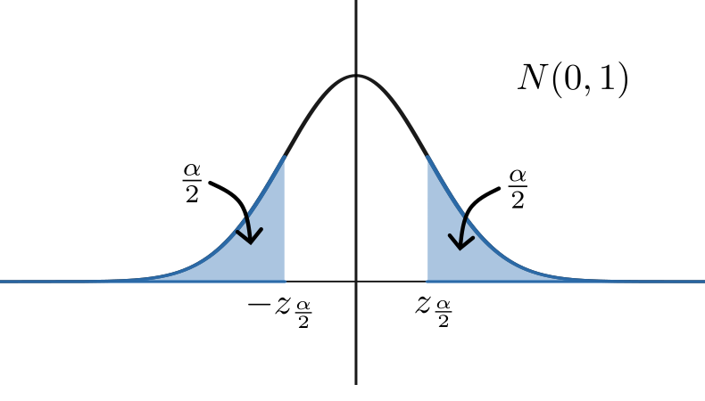

# Hypothesis Testing

> "It's easy to lie with statistics. It's hard to tell the truth without statistics"
>
> --- Andrejs Dunkels


## Introduction

<!-- ::: {.hidden} -->
$$
\newcommand{\nRV}[2]{{#1}_1, {#1}_2, \ldots, {#1}_{#2}}
\newcommand{\var}{{\rm var}}
$$
<!-- ::: -->


So far we have discussed _models_ especially Linear Model where ingridients were **population of interest, smaple data from the population** and more importantly we assumed that the data came from certain model, so we estimated the parameters corresponding to the model. 

In this chapter, we will shift our focus and will take an interest to the following questions:

- Are two sub-population **"different"** or **"same"**?
- Are the measured attributes independent of each other?

For example,

- Are temperatures today higher than they were 100 years ago?
- Does smoking reduce life expectency?
- Is treatment **A** genuinely different from treatment **B**?

In all the above three cases, you take an interest in making an inference about how the value of the parameter relates to a specific numerical value. Is it less than, equal to or greater than a specified given number? This kind of inference is called **test of hypothesis**.

### Elements of Hypothesis testing

::: {.definition #hypothesis-defn name="Hypothesis"}
A statistical **hypothesis** is a statement about the numerical value of a population parameter. 
:::

What hypothesis testing is?
You hypothesise some statement about the data and develop a test which will tell you wheather the hypothesis is resonable or not. And, these are the key steps of hypothesis testing.
To execute a hypothesis testing we will 

- **first**, Make a conjecture
- **second**, Perform some probabilistic and statistical computation to test the conjecture.

Here you will see many application of those probabilistic distributions you learnt earlier, appearing in different tests.

. In the computation step you will compute the likeliness of the 

---

Let's see an example:

Given a coin, we are interested in the probability $p$ of showing heads when tossed. We toss the coin 100 times and record the outcome as $X_1, X_2, \ldots, X_{100} \overset{\mathrm{iid}}{\sim} Ber(p)$ and found that $\sum_{i=1}^{100} X_i = 67$. Till now we used this (in MOM and MLE) to estimate $p$.

Now we ask a diiferent question: Is $p=0.5$ a valid hypothesis given the finding?
,that is, we conjectured that $p=0.5$ and want to 

Observe that, If the coin had an equal chance of heads and tails then chance of 67 heads in 100 tosses is $$\binom{100}{67} \left( \frac{1}{2} \right)^{100} \approx 0.04$$

Anyway let's directly dig into hypothesis test,

- <u>**z-test**</u>: Suppose $X_1, X_2, \ldots, X_n \overset{\mathrm{iid}}{\sim} N(\mu, \sigma^2)$ where, $\sigma$ is known but $\mu$ is unknown. Let $X_1, X_2, \ldots, X_n$ be iid sample from the population.
We compute and find: $$\overline{X} = \frac{X_1 + X_2 + \cdots + X_n}{n}$$


Is $\underset{\mathrm{null \ hypothesis}}{\mu = c}$ or $\underset{\mathrm{alternate \ hypothesis}}{\mu > c}$?

Now the question comes, Given $\overline{X}$; If null hypothesis was true how likely is is that we would have a sample mean as large as the observed value $\overline{X}$?

Answer: $X_1, X_2, \ldots, X_n$ are known. Let $Y_1, Y_2, \ldots, Y_n\overset{\mathrm{iid}}{\sim} N(c, \sigma^2)$
$$\text{Compute:} \quad \mathbb{P}\left(\underset{\mathrm{Random \ variable}}{\overline{Y}} \geq \underset{\mathrm{Determistic \ quantity}}{\overline{X}}\right)$$

$\mathbb{P}({\overline{Y}} \geq \overline{X})$ is called the test statistic which descrobes how likely it is that test statistic $\overline{X}$ would be atleast as far away form $c$ as what was observed.

Define: $$Z := \frac{\sqrt{n}(\overline{Y}-c)}{\sigma} \sim N(0, 1)$$
Now,
$$\begin{align*}
&\mathbb{P}({\overline{Y}} \geq \overline{X}) \\
& = \mathbb{P}\left(\frac{\sqrt{n}(\overline{Y}-c)}{\sigma} \geq \frac{\sqrt{n}(\overline{X}-c)}{\sigma}\right) \\
& = \mathbb{P}\left(Z \geq \frac{\sqrt{n}(\overline{X}-c)}{\sigma}\right)
\end{align*}$$
**We reject the null hypothesis** if the probability is **"small"** (variable at the hands of the user!)

So we fix level $\alpha \in (0,1)$.
If $\mathbb{P}\left(Z \geq \frac{\sqrt{n}(\overline{X}-c)}{\sigma}\right) < \alpha$ then, we conclude that the sample average $\overline{X}$ is so far from $c$ that hypothesis $\mu = c$ is not true!

For example, Suppose $X \sim N(\mu, 9)$. A sample $X_1, X_2, \ldots, X_{16}$ is drawn from $X$ and we observe $\overline{X} = 10.2$

- Null hypothesis: $\mu = 9.5$
- Alternate hypothesis: $\mu > 9.5$
- Level of significance: $\alpha = 0.5$

<u>Answer</u>: $\overline{X} = 10.2; c = 9.5; \sigma = 3; \mu = 16$
Compute: $$\begin{align*}
& \mathbb{P}\left(Z \geq \frac{\sqrt{n}(\overline{X}-c)}{\sigma}\right) \\ 
& = \mathbb{P}\left(Z \geq \frac{\sqrt{16}(10.2-9.5)}{3}\right) \\
& = \mathbb{P}\left(Z \geq \frac{4\times 0.7}{3}\right) \\
& \approx 0.175 \tag{from $Z-$table}
\end{align*}$$
Observe: For, $\alpha = 0.05$ we have $\mathbb{P}\left(Z \geq \frac{\sqrt{n}(\overline{X}-c)}{\sigma}\right) \geq \alpha$.

Conclusion: At level $\alpha$ we can't reject the null hypothesis.

Example 2: Suppose $X \sim N(\mu, 9)$. A sample $X_1, X_2, \ldots, X_{16}$ is drawn from $X$ and we observe $\overline{X} = 10.2$

- Null hypothesis: $\mu = 8.5$
- Alternate hypothesis: $\mu > 8.5$
- Level of significance: $\alpha = 0.5$

<u>Answer</u>: $\overline{X} = 10.2; c = 8.5; n = 16; \sigma = 3; \mu = 16$
Compute: $$\begin{align*}
& \mathbb{P}\left(Z \geq \frac{\sqrt{n}(\overline{X}-c)}{\sigma}\right) \\ 
& = \mathbb{P}\left(Z \geq \frac{\sqrt{16}(10.2-8.5)}{3}\right) \\
& = \mathbb{P}\left(Z \geq \frac{4\times 1.7}{3}\right) \\
& \approx 0.012 \tag{from $Z-$table}
\end{align*}$$
Observe: For, $\alpha = 0.05$ we have $\mathbb{P}\left(Z \geq \frac{\sqrt{n}(\overline{X}-c)}{\sigma}\right) = 0.012 < \alpha$.

Conclusion: At level $\alpha$ as  $\mathbb{P}\left(Z \geq \frac{\sqrt{n}(\overline{X}-c)}{\sigma}\right)$ is less than $\alpha$ , we reject the null hypothesis.


Example 3: Suppose a medical research team wants to design an experiment to determine wheather the newly developed vaccine for a new disease is effective or not?

<u>**Experiment (First cut strategy):**</u>

- Choose: $n-$individuals from the population. $n_1$ of them are given the **vaccine**, $n_2(= n-n_1)$ of them are given the **placebo**.
- Wait a specific amount of time to see how many are affected by the disease.
- Summarize the findings as a $2\times 2$ table:

| | Infected | Not infected | |
|---|---|---|---|
| Vaccine | $X_{11}$ | $X_{12}$ | $n_1$ |
| Placebo | $X_{21}$ | $X_{22}$ | $n_2$ |

**If the vaccine was effective:** Expect a smaller proportion of the vaccinated group to be affected by the disease.

If the chance of getting affected by the disease doesn't depend on wheather the vaccine was given or no, **then the vaccine is ineffective**.

<u>**Approach:**</u> Start by assuming independence ,i.e., the vaccine has no effect unless convinced otherwise by evidence.

<u>**General question/Situation:**</u>

- We have two **"treatments"** applied to a group of experimental units.
- One of two possible outcomes is record.

$$
X_{ij} = \begin{cases}
\text{\# of participants given treatment $i$ and had outcome $j$}
\end{cases}
$$

**Note:** In example above there is an exlicit randomness.

**Assume:** $n-$fixed. Choose $n_1-$randomly without replacement from $n$.

::: {.exercise #ex-intro-1}
Suppose we assume chance of getting the disease is $p$. What is the distribution of $X_{11}$?
:::

**Decision Making(Ideal):** If $X_{11}$ is the among more liekly possiblities (under the independence/vaccine ineffective) then we have no reason to suspect the ineffectiveness of the vaccine.

On the other hand, if $X_{11}$ is the among **"impossible"** possiblities (under the independence/vaccine ineffective) then we have reason to reject the hypothesis of the ineffectiveness of the vaccine.

Now another approach is to test in the parametric setup (more intuitive).

<u>Example:</u> Given a coin and we are interested in the probability $p$ of showing heads when tossed.

Toss teh coin $100$ times. Record sample data as $X_1, X_2, \ldots, X_{100}$ with $X_i \sim Ber(p)$. Get that $\sum_{i=1}^{100} = 67$

Now the same question comes, $p=0.5$ or $p \not= 0.5$?

Answer: Compute
$$
\mathbb{P}\left(\sum_{i=1}^{100} = 67 \right) \ \text{under $p = 0.5$}
$$

Depending on the answer conclude the hypothesis accurate or not

- Find **MLE** of $p$ given $X_1, X_2, \ldots, X_{100}$
- Provide a confidence interval for $p$

<u>Broad procedure to a test:</u>

- $X_1, X_2, \ldots, X_{100}$  are $\rm iid$ sample from $X$
- $X$ has **pmf**/**pdf** $f(x|p)$ $p \in \mathcal{P} \subseteq \mathbb{R}^{\theta}$

<u>Hypothesis that we posed:</u> p=0.5; Restrict the values $p$ can take, say $p \in \mathcal{P} \not\subseteq \mathcal{P}$
Device a computation to test the hypothesis, i.e., find a test statistic $\equiv$ function of sample $X_1, X_2, \ldots, X_{n}$


## $z$ and $t$ test

### $z-$test: Population is $N(\mu, \sigma^2)$ and $\mu$ unknown

Suppose - $X_1, X_2, \ldots, X_{n} \overset{\mathrm{iid}}{\sim} N(\mu, \sigma^2)$ where $\sigma$ is known but **$\mu$ is unknown**.

Let $\mu \in \mathcal{P} = \mathbb{R}$

<u>Hypothesis:</u> $\mu = c \ \text{,i.e.,} \ \ \mathcal{P} = \{c\} \subset \mathcal{P}$

Intuitive test statistic: $\overline{X}$ is the estimator of $\mu = c$

<u>Naive test</u>

Check if $\overline{X} = c$. Say **"$\overline{X}$ is close to $c$"**(depends on $\sigma$). Is there a better approach with $\overline{X}?$

::: {.exercise #ex-hw-z-t}
$\overline{X} \sim N\left(c, \frac{\sigma^2}{n}\right)$ if $\mu = c$ ,i.e., hypothesis is true.
:::
which would result, $\sqrt{n}\left(\frac{\overline{X}-c}{\sigma}\right) \sim N(0,1)$
Another way to express **"if"** statement: If $Y_1, Y_2, \ldots, Y_{n} \overset{\mathrm{iid}}{\sim} N(c, \sigma^2)$  then $\sqrt{n}\left(\frac{\overline{Y}-c}{\sigma}\right) \sim N(0,1)$

Here $Y_i$'s are hypothetical random variables and $N(c, \sigma^2)$ is called **"Null distribution"**

Computing, 
\begin{equation}
\mathbb{P}\left(\frac{\sqrt{n}(\overline{Y}-c)}{\sigma} \geq \frac{\sqrt{n}(\overline{X}-c)}{\sigma}\right) \tag{*}
\end{equation}
allows us to compute, 

::: {.hypothesis #z-ex-1}
$H_0: \mu = c$ vs $H_A: \mu > c$
:::

The $p-$value is the value of $(*)$

Fix $\alpha \in (0,1)$ (level of significance). 

If $p-$value $< \alpha$ then reject the null hypothesis $\mu = c$ in favour  of alternate $\mu > c$.

If $p-$value $\geq \alpha$ then there is no evidence to reject the null hypothesis $\mu = c$ in favour  of alternate $\mu > c$.

<!-- Exercise -->
:::::: {.exercise #z-ex-2}
Device a computation/test of the following:

- $H_0: \mu = c$ vs $H_A: \mu < c$
- $H_0: \mu = c$ vs $H_A: \mu \not= c$

::: {.hint #hint-ex-z-t-1 name="Hint"}
**Hint:** Suitably alter the computation
$\mathbb{P}\left(\frac{\sqrt{n}(\overline{Y}-c)}{\sigma} \geq \frac{\sqrt{n}(\overline{X}-c)}{\sigma}\right)$
:::

::::::


#### Proportions {-}

Let $X_1, X_2, \ldots, X_{n} \overset{\mathrm{iid}}{\sim} Ber(p)$ random variables <br />
and, we want to test: $H_0: p=0.5$ vs $H_A: p \not= 0.5$

Using Binomial Central Limit Theorem you get that, 
$$
\frac{\sqrt{n}(\overline{X}-p)}{\sqrt{p(1-p)}} \overset{d}{\to} Z \sim N(0, 1)
$$

In `R`, there is an inbuilt function `prop.test()`{.R} with which you can do $z-$test.

```r
prop.test(43, 100)
#> 
#> 	1-sample proportions test with continuity correction
#> 
#> data:  43 out of 100, null probability 0.5
#> X-squared = 1.69, df = 1, p-value = 0.1936
#> alternative hypothesis: true p is not equal to 0.5
#> 95 percent confidence interval:
#>  0.3326536 0.5327873
#> sample estimates:
#>    p 
#> 0.43
```
`prop.test()`{.R} does the following:

- Computes $\mathbb{P}\left( \left| Z - 0.5 \right| \geq \left| \frac{\sqrt{n}(\overline{X}-0.5)}{\sqrt{0.5(1-0.5)}} - 0.5 \right| \right)$ towards $p-$value.
- Finds $100(1-\alpha)\% -$confidence interval by finding the region of $p$ where, $$ \left| \frac{\sqrt{n}(\overline{X}-p)}{\sqrt{p(1-p)}} \right| < z_{\frac{\alpha}{2}} \text{ with } \mathbb{P}\left( Z > z_{\frac{\alpha}{2}} \right) = \frac{\alpha}{2} $$ {width=50%}


You can also write code for $z-$test and Confidence Interval for a data `x`:

```r
z_test_ci <- function(x, mu = 0, sigma = 1, alpha = 0.95) {
  z_statistic <- qnorm((1 - alpha) / 2, lower.tail = FALSE)
  sd_x <- sigma / sqrt(length(x))
  p_value <- pnorm((mean(x) - mu) / sd_x, lower.tail = FALSE)

  print(paste0(
    100 * alpha,
    "% Confidence Interval: (",
    mean(x) - z_statistic * sd_x,
    ", ",
    mean(x) + z_statistic * sd_x,
    ")"
  ))
  print(paste0("p-value: ", p_value))
}
```


```r
x <- c(75, 76, 73, 75, 74, 73, 76, 73, 79)
z_test_ci(x, mu = 76, sigma = 1.5)
#> [1] "95% Confidence Interval: (73.9089068966189, 75.8688708811589)"
#> [1] "p-value: 0.986865854308979"
```

<!-- ::: {.exercise #z-ex-3}
Write a code for $t-$test
::: -->


### $t-$test: Test for sample mean when variance is unknown

Assume $X \sim N(\mu, \sigma^2)$ & both $\mu$ and $\sigma$ are unknown.
Let $X_1, X_2, \ldots, X_{n} \overset{\mathrm{iid}}{\sim} N(\mu, \sigma^2)$

::: {.hypothesis #t-ex-1}
$H_0: \mu=c$ vs $H_A: \mu < c$
:::

Let $Y_1, Y_2, \ldots, Y_{n}$ be random variables that **"mimic"** the sampling procedure: $Y \sim N(c, s^2)$

Under, $H_0$ ,i.e., assume $\mu = c$
$$
\sqrt{n}\left(\frac{\overline{Y}-c}{S} \right) \sim t_{n-1}
$$

::: {.question}
\begin{align*}
&\mathbb{P}({\overline{Y}} < \overline{X}) \\
& = \mathbb{P}\left(\frac{\sqrt{n}(\overline{Y}-c)}{S} < \frac{\sqrt{n}(\overline{X}-c)}{S}\right) \\
& = \mathbb{P}\left(T < \frac{\sqrt{n}(\overline{X}-c)}{S}\right) = ?
\end{align*} where $T \sim t_{n-1}$
:::

Fix $\alpha \in (0,1)$. If $\mathbb{P}\left(T < \frac{\sqrt{n}(\overline{X}-c)}{S}\right) < \alpha$ then reject $H_0$

::: {.exercise #ex-t-1}
Prescribe the $t-$test when

- $H_0: \mu = c$ vs $H_A: \mu < c$
- $H_0: \mu = c$ vs $H_A: \mu \not= c$
:::


There is an inbuilt function `t.test()`{.R} in `R` for $t-$test:

```r
t.test(x, mu = 74)
#> 
#> 	One Sample t-test
#> 
#> data:  x
#> t = 1.3571, df = 8, p-value = 0.2118
#> alternative hypothesis: true mean is not equal to 74
#> 95 percent confidence interval:
#>  73.37848 76.39930
#> sample estimates:
#> mean of x 
#>  74.88889
```

### Applications
Suppose one needs to compare two populations.

#### Test for equality of mean, when variance is known

Assume that \begin{align*}
X &\sim N(\mu_1, \sigma_1^2) \\
Y &\sim N(\mu_2, \sigma_2^2)
\end{align*}
where both $\sigma_1$ and $\sigma_2$ are known.

::: {.hypothesis #z-t-app-1}
<br/>
$H_0: \mu_1 = \mu_2$ vs $H_A: \mu_1 \not= \mu_2$ <br/>
which is equivalent to, <br/>
$H_0: \mu_1 - \mu_2 = 0$ vs $H_A: \mu_1 - \mu_2 \not= 0$
:::

So you take ${\rm iid}$ samples, $X_1, X_2, \ldots, X_{n_1}$ from $X$ and $Y_1, Y_2, \ldots, Y_{n_2}$ from $Y$

_Intuitively, you might want to check $\overline{X} - \overline{Y}$ is close to $0$ or not._

Under the assumptions:
$$
\overline{X} - \overline{Y} \sim N \left(\mu_1-\mu_2, \frac{\sigma_1^2}{n_1} + \frac{\sigma_2^2}{n_2} \right)
$$
Now, $Z \sim N(0,1)$
Fix, $\alpha \in (0,1)$.
If $$
\mathbb{P}\left( |Z| \geq \frac{ \left|\overline{X} - \overline{Y} \right| }{\sqrt{\frac{\sigma_1^2}{n_1} + \frac{\sigma_2^2}{n_2} }} \right) < \alpha
$$
reject $H_0$.


#### Test for proportions when variance is unknown

Assume that, we have 2 coins with $p_1$ and $p_2$ probability of heads

::: {.hypothesis #z-t-app-1}
$H_0: p_1 = p_2$ vs $H_A: p_1 \not= p_2$
:::

You sample, $X_1, X_2, \ldots, X_{n} \overset{\mathrm{iid}}{\sim} Ber(p_1)$ and $Y_1, Y_2, \ldots, Y_{n} \overset{\mathrm{iid}}{\sim} Ber(p_2)$ by tossing the coins.

Let, $$
\hat{p_1} = \overline{X} \text{ and } \hat{p_2} = \overline{Y}
$$

you have the test-statistic: $$
\frac{\hat{p_1} - \hat{p_2}}{\sqrt{\frac{2\hat{p}(1-\hat{p})}{n}}}
$$ 
with $\hat{p} = \frac{\hat{p_1} + \hat{p_2}}{2}$. Here, $\frac{2\hat{p}(1-\hat{p})}{n}$ is known as **Pooled variance**

## Likelihood approach
In the genral approach,

- We assume that som random variable $X$ has a **pdf**/**pmf** $f(\cdot | p)$ with $p \in \mathcal{P} \subseteq \mathbb{R}$.
- Sample $X_1, X_2, \ldots, X_{n} \overset{\mathrm{iid}}{\sim} X$
- the likelihood function of the given sample $X_1, X_2, \ldots, X_{n}$ is $$L(p; X_1, X_2, \ldots, X_{n}) = \prod_{i=1}^{n} f(X_i | p)$$

Recall that **MLE**, $\hat{p} = \argmax_{p \in \mathcal{P}}L(p; X_1, X_2, \ldots, X_{n})$ 

Observe that we can view the hypothesis test as a restriction of $\mathcal{P}$ to a smaller subset $\mathcal{P}_0$

For example, $\mathcal{P} = \{c\}$ in the **"intuitive approach"** above, 
$$
H_0: \underset{(\mu = c)}{p \in \mathcal{P}_0} \qquad \qquad H_A: \underset{(\mu \not= c)}{p \not\in \mathcal{P}_0}
$$

### MLE approach under null hypothesis with $p \in \mathcal{P}_0 \subset \mathcal{P}$
$$\hat{p} = \argmax_{p \in \mathcal{P}} L(p; X_1, X_2, \ldots, X_{n})$$

**Likelihood ratio:** Given, a sample $X_1, X_2, \ldots, X_{n}$, define
$$ \lambda(X_1, X_2, \ldots, X_{n}) = \frac{L(\hat{p}_0; X_1, X_2, \ldots, X_{n})}{L(\hat{p}; X_1, X_2, \ldots, X_{n})} $$
as the **Likelihood ratio** and define,
$$\begin{align*}
\Lambda(X_1, X_2, \ldots, X_{n}) 
&= -\log{\lambda(X_1, X_2, \ldots, X_{n})} \\
&= -\log{\frac{L(\hat{p}_0; X_1, X_2, \ldots, X_{n})}{L(\hat{p}; X_1, X_2, \ldots, X_{n})}} \\
\end{align*}$$
as **log-likelihood ratio**.

::: {.exercise #ex-log-liklihood}
$$
\text{If  } \mathcal{P}_0 \subseteq \mathcal{P} \text{ then } 0 \leq \frac{L(\hat{p}_0; X_1, X_2, \ldots, X_{n})}{L(\hat{p}; X_1, X_2, \ldots, X_{n})} \leq 1
$$
:::

which would imply, 
\begin{align*}
0 &\leq \Lambda(X_1, X_2, \ldots, X_{n})\\
&= -\log{\frac{L(\hat{p}_0; X_1, X_2, \ldots, X_{n})}{L(\hat{p}; X_1, X_2, \ldots, X_{n})}}\\
&= \log{\frac{L(\hat{p}; X_1, X_2, \ldots, X_{n})}{L(\hat{p}_0; X_1, X_2, \ldots, X_{n})}}
\end{align*}

If $\hat{p}$ is further away from $\mathcal{P}_0$ in terms of $L$ then less likely it is that $\mathcal{P}_0$ is true as the null hypothesis ,i.e., for larger values of $\Lambda$

### $z-$test with log-liklihood
Let, $X \sim N(\mu, \sigma^2)$ with $\mu \in \mathcal{P} = \mathbb{R}$ and $\sigma$ is known. The null and alternate hypothesis be $H_0: \mu = c$ and $H_A: \mu \not= c$ ,i.e., $\mathcal{P}_0 = \{c\}$.  

Now given, a sample $X_1, X_2, \ldots, X_{n}$, the log-likelihood function for $\mu$,
$$
L(\mu; X_1, X_2, \ldots, X_{n}) = \prod_{i=1}^{n} \frac{e^{-\frac{(X_i - \mu)^2}{2\sigma^2}}}{\sqrt{2\pi}\sigma}
$$

::: {.exercise #ex-log-likelihood-2}
Show that,
$$\hat{\mu} 
= \argmax_{\mu \in \mathcal{P}} \ L(\mu; X_1, X_2, \ldots, X_{n}) 
= \overline{X}$$
and, $$\hat{\mu}_0 
= \argmax_{\mu \in \mathcal{P}_0} L(\mu; X_1, X_2, \ldots, X_{n}) 
= c$$
:::

then we will have,
\begin{align*}
\Lambda(X_1, X_2, \ldots, X_{n})
&= \log{\frac{L(\mu; X_1, X_2, \ldots, X_{n})}{L(\mu_0; X_1, X_2, \ldots, X_{n})}} \\
&= \log{\frac{L(\overline{X}; X_1, X_2, \ldots, X_{n})}{L(c; X_1, X_2, \ldots, X_{n})}} \\
&= \log{\frac{\prod_{i=1}^{n} \frac{e^{-\frac{(X_i - \overline{X})^2}{2\sigma^2}}}{\sqrt{2\pi}\sigma}}{\prod_{i=1}^{n} \frac{e^{-\frac{(X_i - c)^2}{2\sigma^2}}}{\sqrt{2\pi}\sigma}}} \\
&= \frac{1}{2} \frac{n}{\sigma^2}(\overline{X} - c)^2
= \frac{1}{2} \left( \frac{\sqrt{n}(\overline{X} - c)}{\sigma} \right)^2
\end{align*}

::: {.exercise #ex-log-liklihood-3}
Prove that,
$$
\log{\frac{\prod_{i=1}^{n} \frac{e^{-\frac{(X_i - \overline{X})^2}{2\sigma^2}}}{\sqrt{2\pi}\sigma}}{\prod_{i=1}^{n} \frac{e^{-\frac{(X_i - c)^2}{2\sigma^2}}}{\sqrt{2\pi}\sigma}}} 
= \frac{1}{2}\frac{n}{\sigma^2}(\overline{X} - c)^2
$$
:::

Let $Y_1, Y_2, \ldots, Y_{n}$ be $\rm iid$ random variables that **"imitate"** sample under $H_0$. We have to check,
$$
\underbrace{\mathbb{P}
\left( 
  \Lambda(Y_1, Y_2, \ldots, Y_{n}) 
\geq 
  \Lambda(X_1, X_2, \ldots, X_{n}) 
\right)}_{p-\text{value of the test}}
$$

We know, 
\begin{align*}
\Lambda(Y_1, Y_2, \ldots, Y_{n}) \\
&= \frac{1}{2} \left( \frac{\sqrt{n}(\overline{Y} - c)}{\sigma} \right)^2 \\
&= \frac{Z^2}{2}
\end{align*}
where, $Z = \frac{\sqrt{n}(\overline{Y} - c)}{\sigma} \sim N(0,1)$
So, one can compute the $p-$value as $\mathbb{P} \left( Z^2 \geq \left( \frac{\sqrt{n}(\overline{Y} - c)}{\sigma} \right)^2 \right)$

### Seeing the mean is larger that **c** or not

Let $X \sim N(\mu, \sigma^2)$ with $\sigma$ known.
$H_0: \mu \leq c$ vs $H_A: \mu > c$

Sample $X_1, X_2, \ldots, X_{n}$ from population and compute,
$$
\Lambda(X_1, X_2, \ldots, X_{n})
= \log{\frac{L(\hat{\mu}; X_1, X_2, \ldots, X_{n})}{L(\hat{\mu}_0; X_1, X_2, \ldots, X_{n})}}
$$
where, $\hat{\mu}_0 = \argmax_{\mu \in \mathcal{P}_0} L(\mu; X_1, \ldots, X_n)$ with $\mathcal{P}_0 = (-\infty, c]$
and, $\hat{\mu} = \argmax_{\mu \in \mathcal{P}} \ L(\mu; X_1, \ldots, X_n)$ with $\mathcal{P} = \mathbb{R}$

::: {.exercise #ex-log-liklihood-4}
Show the following:

- $\hat{\mu} = \overline{X}$
- $\hat{\mu}_0 = \argmax_{\mu \in \mathcal{P}_0} \prod_{i=1}^{n} \frac{e^{-\frac{(X_i - \mu)^2}{2\sigma^2}}}{\sqrt{2\pi}\sigma} = \min{\{\overline{X}, c\}}$
- \begin{align*}
\Lambda(X_1, X_2, \ldots, X_{n}) 
&= \log{\frac{L(\hat{\mu}; X_1, X_2, \ldots, X_{n})}{L(\hat{\mu}_0; X_1, X_2, \ldots, X_{n})}} \\
&= \begin{cases}
0 &{\rm if } \ \overline{X} \leq c \\
\frac{n(\overline{X} - c)^2}{2\sigma^2} &{\rm if } \ \overline{X} = c
\end{cases}
\end{align*}
:::

And finally, we shall compute the $p-$value as, $\mathbb{P} \left( \frac{\sqrt{n}(\overline{Y} - c)}{\sigma} \geq \frac{\sqrt{n}(\overline{X} - c)}{\sigma} \right) = \mathbb{P} \left( Z \geq \frac{\sqrt{n}(\overline{X} - c)}{\sigma} \right)$

## $\chi^2$ goodness of fit

## Non-parametric tests
